```mermaid
graph TB
subgraph "User Interface Layer"
Editor[Code Editor]
CLI[CLI Tool]
WebUI[Web Dashboard]
end

    subgraph "ACP Orchestrator"
        MessageBroker[Message Broker]
        WorkflowEngine[Workflow Engine]
        StateManager[State Manager]
    end
    
    subgraph "Agent Layer (ACP Agents)"
        Discovery[Discovery Agent]
        Spec[Spec Agent]
        Validation[Validation Agent]
        Domain[Domain Agent]
        Design[Design Agent]
        TaskPlan[Task Planning Agent]
        Impl[Implementation Agent]
        Refactor[Refactor Agent]
        QA[QA Agent]
        Knowledge[Knowledge Agent]
        Security[Security Agent]
        Observability[Observability Agent]
        DevOps[DevOps Agent]
    end
    
    subgraph "Human Agents (ACP Participants)"
        POAgent[Product Owner Agent]
        TLAgent[Tech Lead Agent]
        EngineerAgent[Engineer Agent]
    end
    
    subgraph "Repository Layer"
        FileSystem[Git Repository]
    end
    
    Editor --> MessageBroker
    CLI --> MessageBroker
    WebUI --> MessageBroker
    
    MessageBroker --> WorkflowEngine
    WorkflowEngine --> Discovery
    WorkflowEngine --> Spec
    WorkflowEngine --> Validation
    
    Discovery -->|CAPABILITY_GENERATED| MessageBroker
    Spec -->|REQUIREMENTS_GENERATED| MessageBroker
    Validation -->|VALIDATION_PASSED| MessageBroker
    Validation -->|VALIDATION_BLOCKED| MessageBroker
    
    MessageBroker -->|REQUEST_APPROVAL| POAgent
    MessageBroker -->|ESCALATE| TLAgent
    
    POAgent -->|APPROVED| MessageBroker
    TLAgent -->|RESOLVED| MessageBroker
    
    Discovery --> FileSystem
    Impl --> FileSystem
    Knowledge --> FileSystem
```

```json
{
  "protocol": "ACP/1.0",
  "message_id": "msg_001",
  "timestamp": "2026-03-19T10:30:00Z",
  "sender": {
    "agent_id": "discovery_agent_001",
    "agent_type": "DiscoveryAgent",
    "version": "5.0"
  },
  "recipient": {
    "agent_id": "spec_agent_001",
    "agent_type": "SpecAgent"
  },
  "message_type": "REQUEST | RESPONSE | EVENT | NOTIFICATION | ERROR",
  "conversation_id": "conv_password_reset_feature",
  "payload": {
    // Message-specific data
  },
  "metadata": {
    "confidence": 0.92,
    "phase": 1,
    "spec_name": "password-reset",
    "requires_human_approval": false
  }
}
```