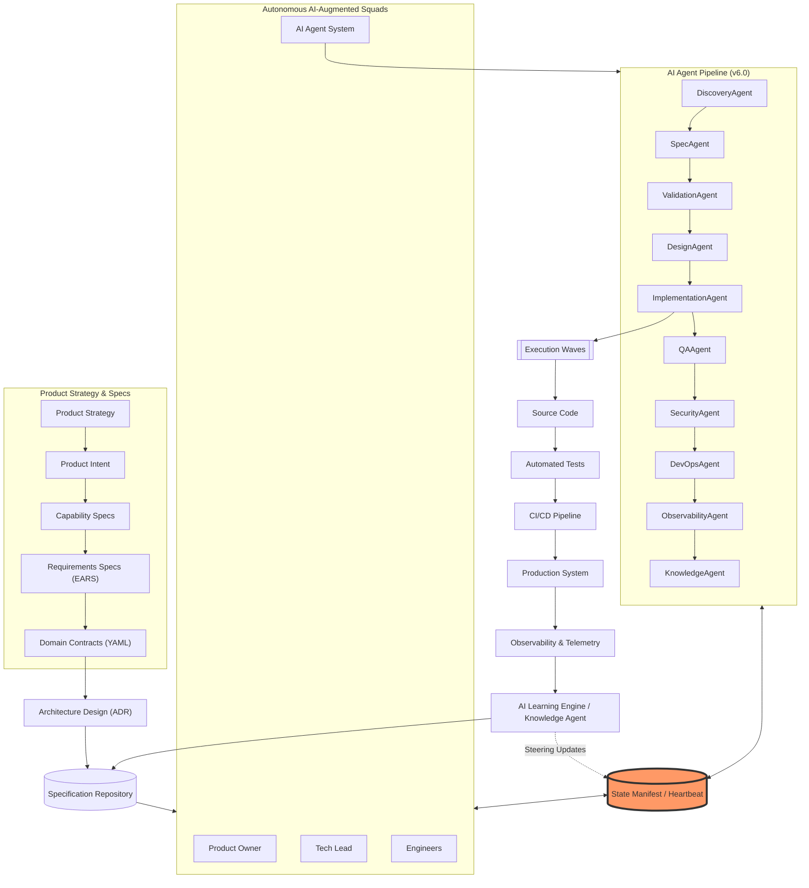
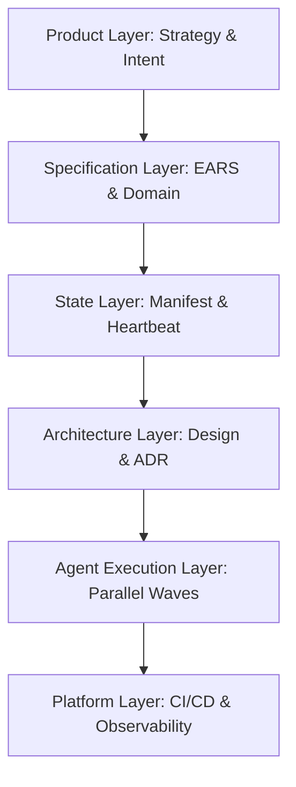
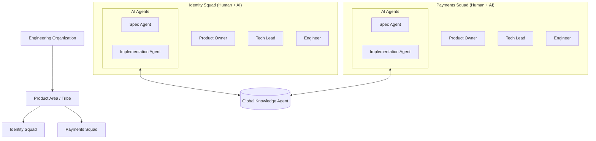
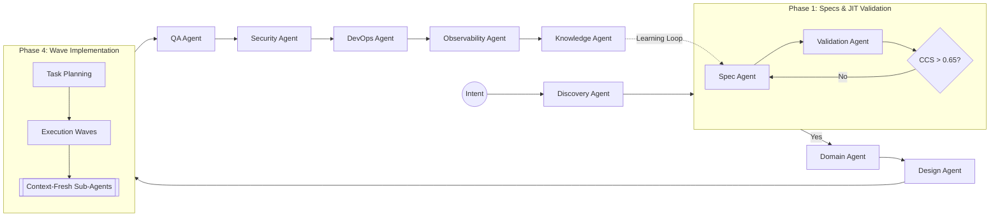
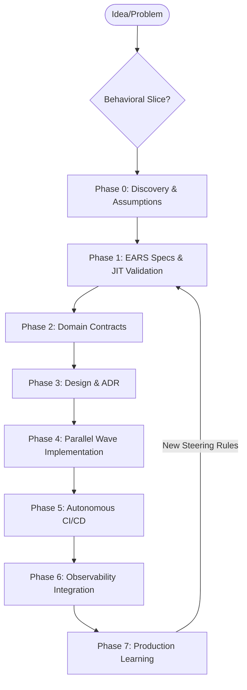
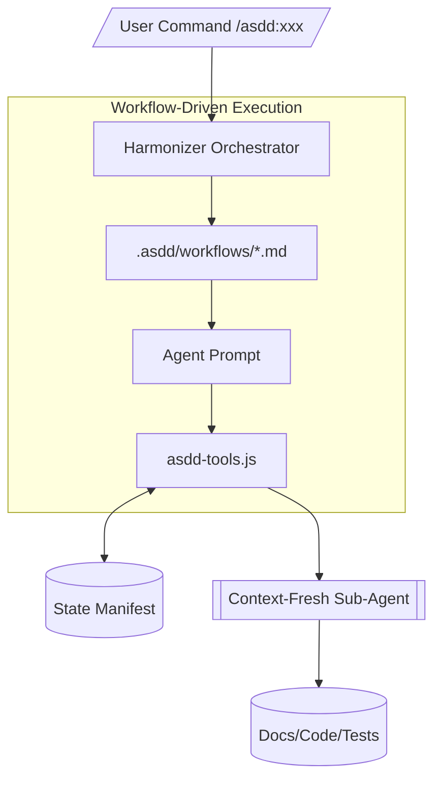
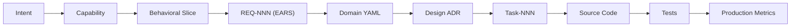
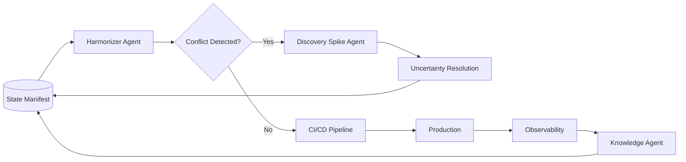
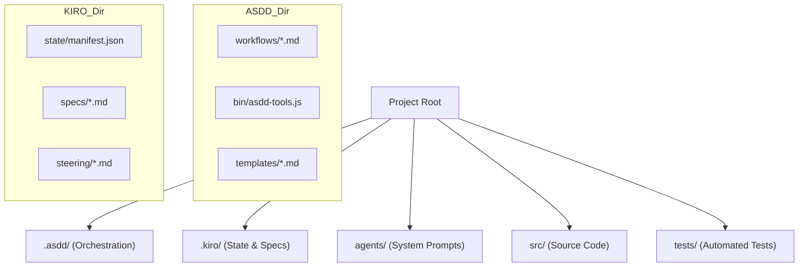
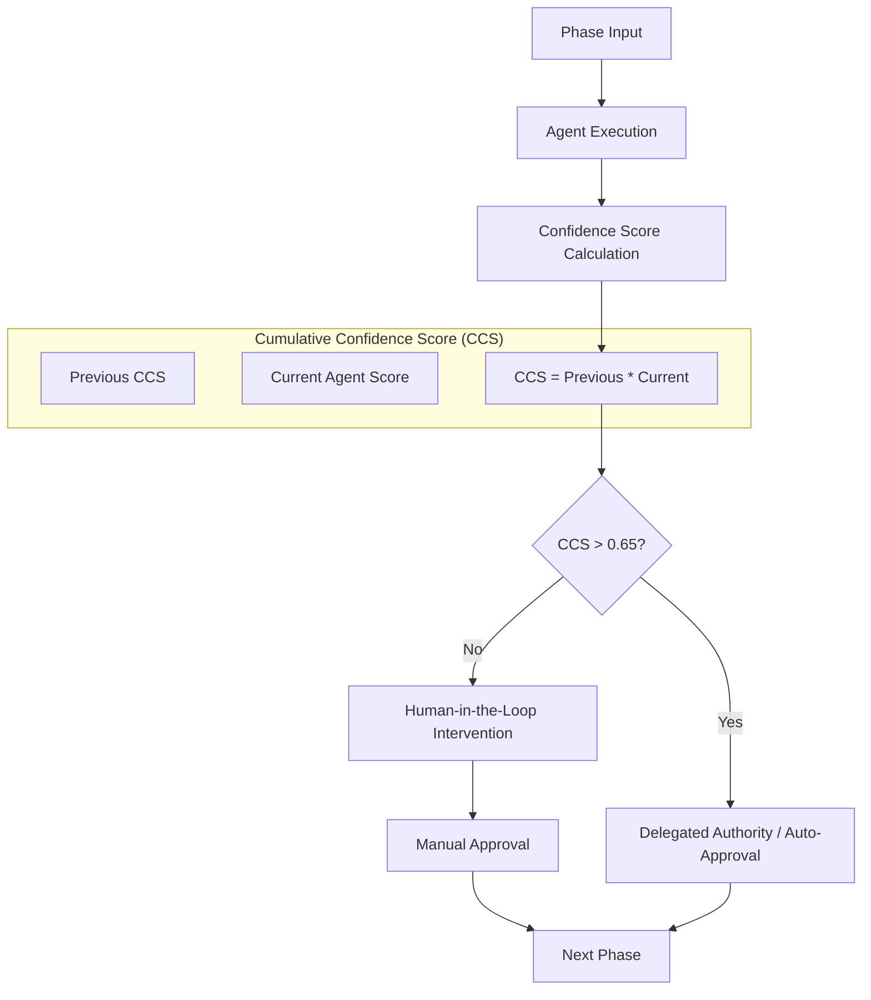

# ASDD Master Architecture & Visual Pack (v6.0)

This document consolidates the **ASDD Master Architecture** and the **Visual Architecture Pack** into a single, unified source of truth. It reflects the latest updates from the ASDD v5.0 framework, including **Workflow-Driven Orchestration**, **Behavioral Slicing**, and the **State Manifest Backbone**.

---

# 1. ASDD Master System (The Big Picture)

The complete operating model of ASDD, showing how product strategy, specifications, and AI-augmented squads interact through a state-aware pipeline.

---

# 2. ASDD Architectural Layers

The five layers that define the ASDD structural hierarchy, now including the **State/Manifest** as a core coordination layer.

---

# 3. Organizational Architecture (Tribes & Squads)

ASDD is designed for **human-AI collaboration** at scale, organizing around specialized squads supported by a shared agentic infrastructure.

---

# 4. AI Agent Orchestration Pipeline (v6.0)

The high-velocity pipeline where agents transform intent into verified software through deterministic gates.

---

# 5. ASDD Lifecycle (Behavioral Slicing)

The lifecycle is now **slice-based** rather than monolithic, allowing features, bugs, and improvements to flow through the pipeline independently.

---

# 6. AI Agent Runtime Architecture (Workflow-Driven)

Agents are no longer just prompts; they are **Workflow Executors** that interact with the system via deterministic tools.

---

# 7. Specification to Code Traceability

Full-spectrum traceability from high-level product intent to individual lines of code and production metrics.

---

# 8. Autonomous Delivery Loop (The Harmonizer)

The system maintains its own health and architectural integrity through the **Harmonizer** and **Knowledge Agent**.

---

# 9. Repository Architecture (v6.0)

The standardized ASDD project structure, incorporating the new `.asdd/` orchestration and `.kiro/` state folders.

---

# 10. AI Governance & CCS Model

The **Product Law of Confidence** ensures that AI autonomy is earned through verified quality scores.

---

# Summary of Visual Architecture

| ID | Diagram | Key v6.0 Concept |
| :--- | :--- | :--- |
| 1 | **ASDD Master System** | The State Manifest Backbone & Learning Loop |
| 2 | **ASDD Layers** | The State/Manifest layer integration |
| 3 | **Organization** | Tribes, Squads, and Shared Knowledge |
| 4 | **Agent Pipeline** | CCS Gates and Parallel Wave Execution |
| 5 | **Lifecycle** | Behavioral Slicing and JIT Validation |
| 6 | **Runtime** | Workflow-Driven Orchestration (asdd-tools) |
| 7 | **Traceability** | Behavioral Slices and REQ-to-Code mapping |
| 8 | **Delivery Loop** | The Harmonizer and Discovery Spike Agents |
| 9 | **Repository** | `.asdd/` (Tools) and `.kiro/` (State) folders |
| 10 | **Governance** | The Product Law of Confidence (CCS > 0.65) |

Together these diagrams illustrate **how ASDD v5.0+ transforms software engineering into a safety-first, high-velocity autonomous system.**
