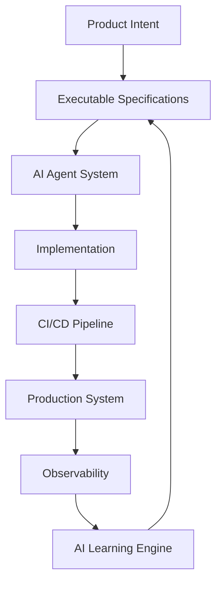
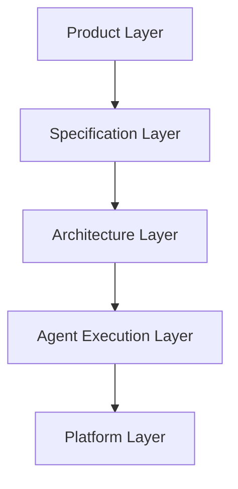
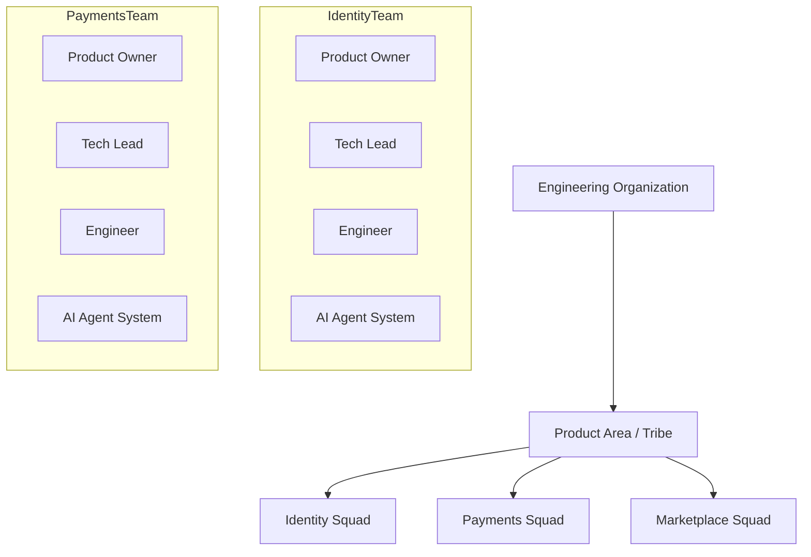
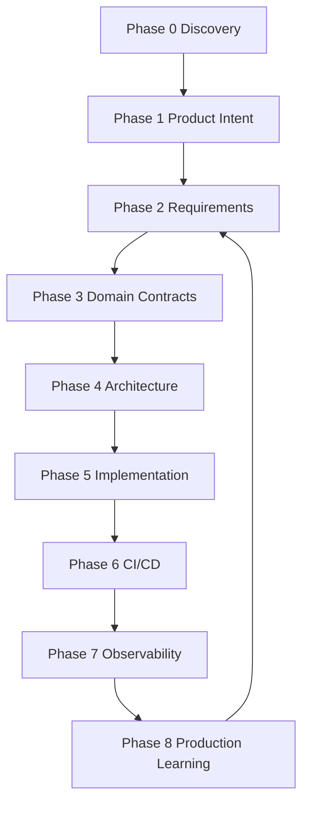
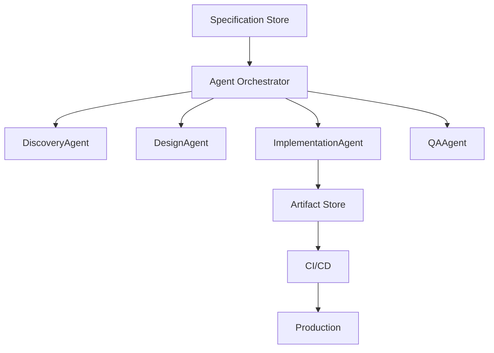
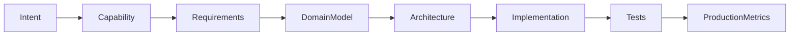
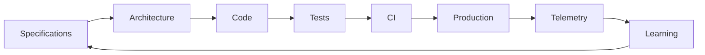
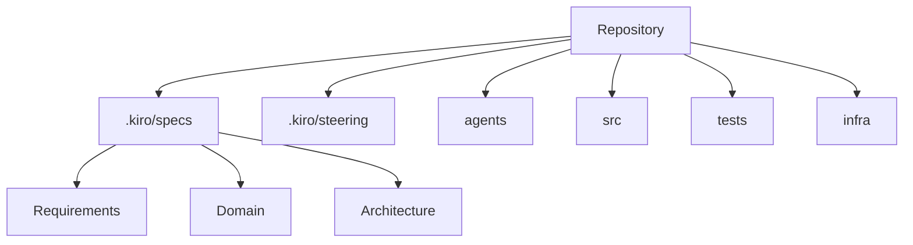
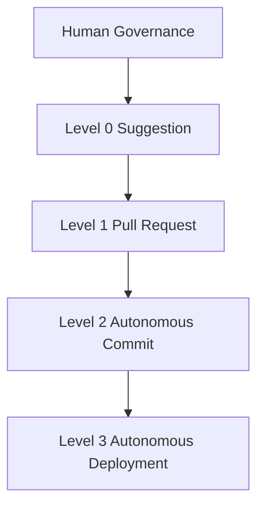

# ASDD Visual Architecture Pack

## Agentic Specification-Driven Development

Version: 4.1
Year: 2026

This document contains **10 core diagrams** that explain the architecture of the **ASDD framework**.

---

# 1. ASDD System Overview

This diagram provides the **high-level conceptual architecture** of ASDD.



Purpose:

Shows the **continuous improvement loop** between specifications and production systems.

---

# 2. ASDD Architectural Layers

This diagram illustrates the **five layers of the ASDD architecture**.



Layer responsibilities:

| Layer           | Responsibility               |
| --------------- | ---------------------------- |
| Product         | Strategic goals              |
| Specification   | Requirements and contracts   |
| Architecture    | System design                |
| Agent Execution | AI agents implementing specs |
| Platform        | Infrastructure and CI/CD     |

---

# 3. Organizational Architecture (Tribes & Squads)

This diagram shows **how ASDD teams are organized**.



Key concept:

Each squad is **human + AI augmented**.

---

# 4. AI Agent Orchestration Pipeline

This diagram shows the **agent collaboration pipeline**.

```mermaid
flowchart LR

Intent[Product Intent]

Intent --> DiscoveryAgent

DiscoveryAgent --> SpecAgent

SpecAgent --> ValidationAgent

ValidationAgent --> DesignAgent

DesignAgent --> ImplementationAgent

ImplementationAgent --> QAAgent

QAAgent --> SecurityAgent

SecurityAgent --> DevOpsAgent

DevOpsAgent --> ObservabilityAgent

ObservabilityAgent --> KnowledgeAgent
```



Agents progressively transform:

```
idea → specification → architecture → code → validated system
```

---

# 5. ASDD Lifecycle

The lifecycle describes **how systems evolve over time**.



Production data continuously improves specifications.

---

# 6. AI Agent Runtime Architecture

This diagram explains **how agents run inside the platform**.



This architecture enables **automated development pipelines**.

---

# 7. Specification to Code Traceability

ASDD ensures **full traceability** across the development lifecycle.



This traceability improves:

* audits
* governance
* debugging
* compliance

---

# 8. Autonomous Delivery Loop

This diagram shows the **self-improving system loop**.



This loop enables **continuous evolution of the system**.

---

# 9. Repository Architecture

ASDD standardizes repository structure.



Benefits:

* clear traceability
* easier AI navigation
* better automation

---

# 10. AI Governance Model

This diagram shows **how AI autonomy levels are controlled**.



Organizations can **gradually increase AI autonomy**.

---

# Summary

The ASDD architecture consists of:

| Domain       | Diagram            |
| ------------ | ------------------ |
| System       | ASDD overview      |
| Architecture | ASDD layers        |
| Organization | Tribes & squads    |
| AI Workflow  | Agent pipeline     |
| Process      | Lifecycle          |
| Runtime      | Agent architecture |
| Governance   | AI autonomy        |
| Traceability | Spec-to-code       |
| Evolution    | Delivery loop      |
| Repository   | Project structure  |

Together these diagrams illustrate **how ASDD transforms software engineering into an AI-native system**.
