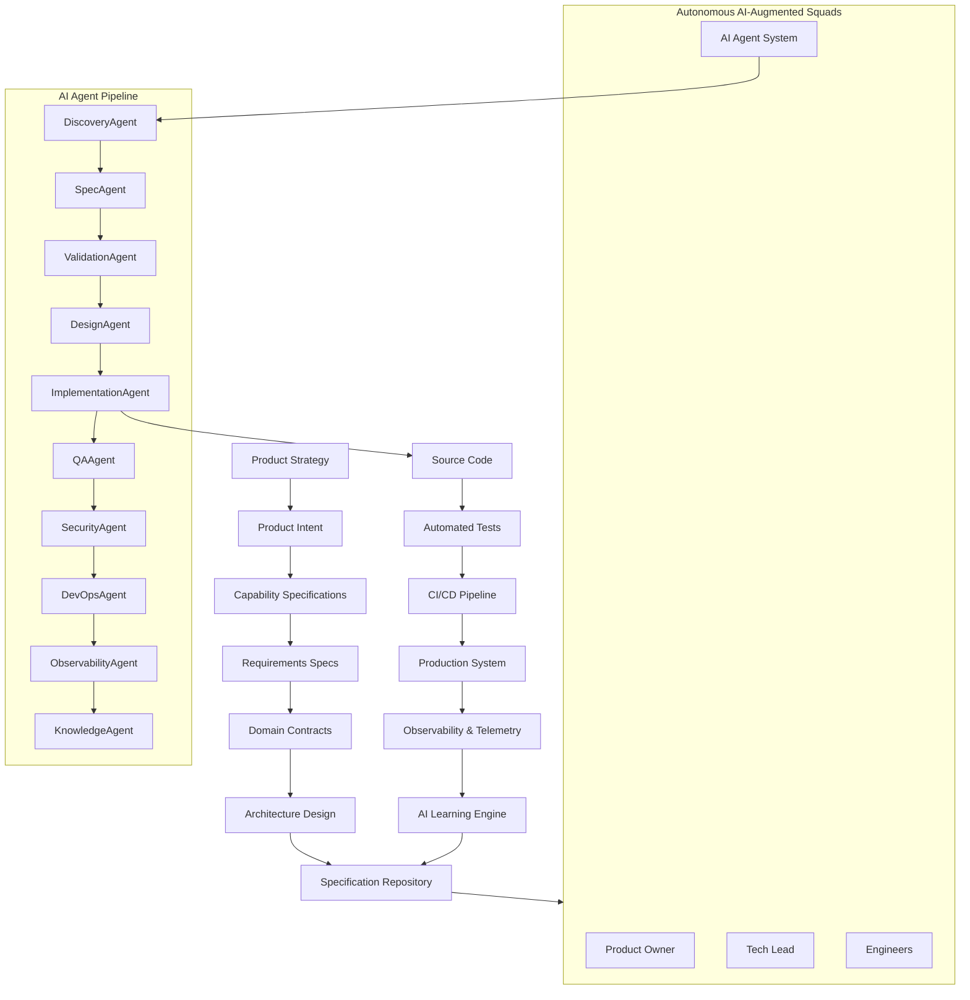

# ASDD Master Architecture Diagram

## Agentic Specification-Driven Development

This diagram represents the **complete operating model of ASDD**.

It shows how:

* Product strategy drives specifications
* Specifications drive AI agents
* Agents produce software
* Production systems feed learning back into specifications

---

## ASDD Master System



---

# What This Diagram Shows

### 1. Product Strategy Layer

```
Strategy → Intent → Capability → Requirements
```

This ensures **business goals are traceable to implementation**.

---

### 2. Specification Layer

Specifications define:

* requirements
* domain models
* architecture

These are stored in a **central specification repository**.

---

### 3. AI-Augmented Squads

Each squad includes:

| Role          | Responsibility            |
| ------------- | ------------------------- |
| Product Owner | business intent           |
| Tech Lead     | architecture governance   |
| Engineers     | spec execution            |
| AI Agents     | automation and generation |

---

### 4. AI Agent Pipeline

Agents transform specifications into running software.

Pipeline:

```
Discovery → Spec → Validation → Design → Implementation → QA → Security → DevOps → Observability → Knowledge
```

---

### 5. Implementation & Delivery

The pipeline produces:

```
code → tests → CI/CD → production systems
```

---

### 6. Production Learning Loop

Production telemetry feeds back into specifications.

```
production → telemetry → learning → improved specs
```

This enables **self-improving systems**.

---

# Why This Diagram Matters

This diagram communicates the entire framework in one view.

It shows how ASDD connects:

| Domain       | Component                |
| ------------ | ------------------------ |
| Organization | squads                   |
| Process      | lifecycle                |
| Technology   | AI agents                |
| Architecture | specification repository |
| Operations   | CI/CD + observability    |

Together they form an **AI-native engineering system**.

---

# How to Use This Diagram

This diagram should appear in:

* the **ASDD whitepaper introduction**
* the **GitHub repository README**
* engineering **onboarding documentation**
* internal **architecture presentations**

It acts as the **visual overview of the entire methodology**.
