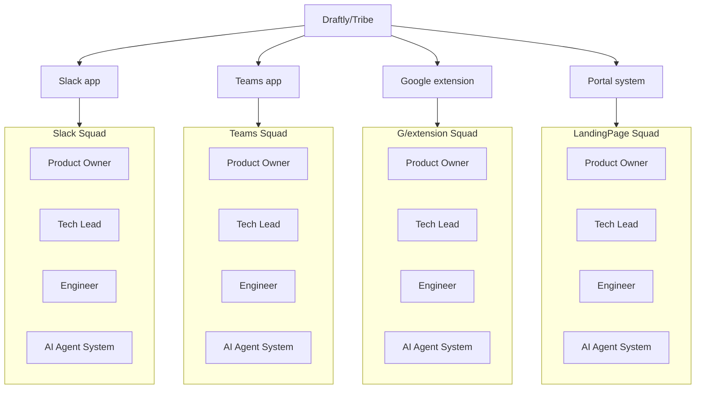
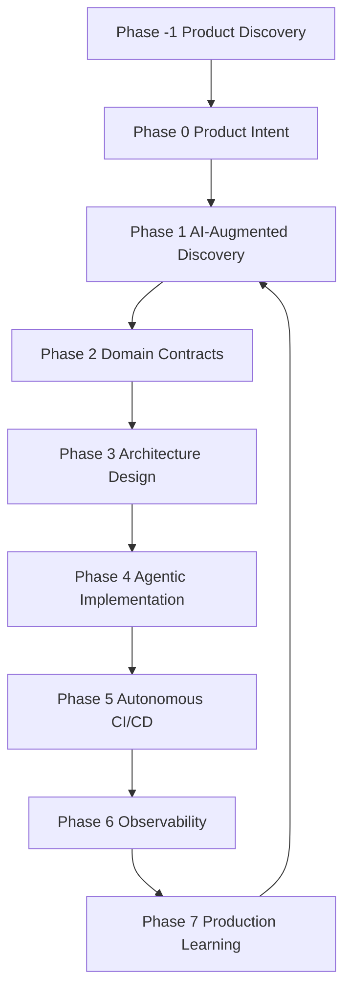

# Agentic Specification-Driven Development Framework

Version: 4.0
Year: 2026
Audience: Engineering Leaders, Product Owners, AI Engineers, Architects
Author: Edwin Encinas 
---

# Abstract

Software engineering is entering a new era where **AI agents actively participate in the development lifecycle**. Traditional agile methodologies were designed for human-only teams and are not optimized for AI-augmented environments.

This document introduces **Agentic Specification-Driven Development (ASDD)** — a framework for building software using **AI-assisted specifications, autonomous agents, and production learning loops**.

ASDD enables small engineering teams to achieve dramatically higher output while maintaining architecture quality, security, and system observability.

---

# 1. Introduction

## 1.1 The Limits of Traditional Agile

Most modern software teams use frameworks such as:

* Scrum
* Kanban

These frameworks focus on:

* human collaboration
* incremental delivery
* iterative planning

However, they assume that **software is primarily written by humans**.

AI-augmented development introduces new challenges:

* AI hallucinations
* architectural drift
* inconsistent code generation
* lack of specification traceability

Traditional agile processes do not address these problems.

---

# 2. The Rise of AI-Native Engineering

Modern development environments increasingly integrate AI capabilities such as:

* code generation
* automated testing
* architecture suggestions
* CI/CD automation

Examples include tools such as:

* Kiro IDE
* Jira with Rovo AI
* GitHub Copilot

These tools represent an evolution toward **agentic software development**, where AI participates actively in the engineering lifecycle.

---

# 3. What Is ASDD?

**Agentic Specification-Driven Development (ASDD)** is a framework that combines:

* specification-driven development
* AI agent orchestration
* automated validation pipelines
* production feedback learning

Solving Modern software teams face several challenges:

• ambiguous requirements  
• inconsistent architectures  
• fragmented documentation  
• slow delivery cycles  
• scaling engineering teams

## 3.1 The core idea:

> Specifications become the central artifact that coordinates humans and AI.

Instead of starting with code, development begins with **structured, machine-interpretable specifications**.

## 3.2 Conceptual Flow

Idea → Specification → Architecture → AI Implementation → Validation → Deployment → Production Learning

## 3.3 Layers

* Product Layer: Defines strategic intent and product goals.

* Specification Layer: Executable artifacts describing requirements and domain models.

* Agent Execution Layer: AI agents transform specifications into architecture, tests, and code.

* Platform Layer: Infrastructure enabling automation, CI/CD, and observability.

---

# 4. Core Principles

ASDD is built on six principles.

---

## 4.1 Ambiguity Is a Bug

Ambiguous requirements cause:

* misinterpretation
* inconsistent implementations
* AI hallucinations

ASDD enforces **machine-interpretable specifications**.

---

## 4.2 Specifications Are Executable

Specifications are not passive documentation.

They generate:

* tests
* architecture
* validation rules
* API contracts

---

## 4.3 AI Is a Pilot, Not a Passenger

AI agents actively participate in development.

Humans remain responsible for:

* product vision
* governance
* architectural decisions

---

## 4.4 Contracts Over Code

Each phase of the lifecycle produces **formal contracts**(API, Domain, or Arch).

Examples include:

* requirements contracts
* domain models
* API contracts
* architecture contracts

---

## 4.5 Production Data Evolves the System

Systems continuously learn from:

* telemetry
* user behavior
* system failures

---

## 4.6 Small Teams + AI Scale Engineering Capacity

ASDD assumes **small squads augmented by AI agents**.

A typical squad contains:

* 3 humans
* 6–10 AI agents

---

# 5. Organizational Model

ASDD adopts the **squad-based structure popularized by Spotify engineering culture**.
Each squad owns a specific domain and operates independently while following shared architectural governance.



---

## 5.1 Tribe(Product Areas)

Large systems are divided into **Tribe/product areas**.
Group of squads working on a domain Shared standards, tooling, and architecture.

Example:

```
Slack Application
MIcrosoft Teams Application
Google Extension
Portal Systems
```

---

## 5.2 Squads

Each product area contains several **squads**.

Example:

```
Slack Squad
Teams Squad
G/Extention Squad
LandingPage Squad
```

## 5.3 Squad Composition

ASDD operates via Autonomous Squads within Product Areas (Tribes):

| Role                   | Count   | Accountability                                         |
|------------------------|---------|--------------------------------------------------------|
| Product Owner (Shared) | 0.5 FTE | Responsible for "Strategic Intent" and Business Specs. |
| Tech Lead              | 1       | Responsible for technical integrity and ASDD flow.     |
| Engineers              | 1-3     | Orchestrate agents and validate spec-fidelity.         |
| AI Agent System        | 6-10    | Execute the implementation, QA, and DevOps loops.      |

> One Product Owner may serve **2–3 squads**, depending on complexity.

AI agents dramatically increase team productivity.

## 5.4 Roles & Responsibilities

### 5.4.1 Product Owner (PO)

**Primary Accountability:** *Meaning and Business Value*

Responsibilities:

* Owns **Capability Specs** (not tasks)
* Defines business rules, constraints, and success metrics
* Prioritizes specs in the backlog
* Validates specs before approval
* Accepts outcomes based on spec compliance

**What the PO no longer does:**

* Write detailed user stories
* Clarify requirements during sprints
* Negotiate scope mid-sprint

### 5.4.2 Tech Lead (TL)

**Primary Accountability:** *Flow, Quality, and Technical Integrity*

Responsibilities:

* Enforces SDD workflow and gates
* Facilitates sprint ceremonies
* Ensures specs are implementation-ready
* Owns technical coherence and architecture
* Removes blockers before sprint start
* Coaches the team in Agile and SDD practices

**Dual Role Justification:**

* Small teams require **fast decision-making**
* Combines delivery flow + technical leadership

### 5.4.3 Engineers Team (1-3 Developers)

**Primary Accountability:** *Execution and Spec Fidelity*

Responsibilities:

* Implement exactly what is defined in the spec
* Identify spec gaps **before sprint start**
* Write tests mapped to spec behaviors
* Emit events, logs, and metrics as defined
* Reject undocumented behavior

**Key Rule:**

> Engineers do not interpret intent — they implement specs.

#### 5.4.3.1 Engineers Core Principles

1. **Specs before Sprints** – No work enters a sprint without an approved spec
2. **Single Source of Truth** – Specs replace scattered user stories and acceptance criteria
3. **Autonomous Squads** – Each squad owns a business capability end-to-end
4. **Role Clarity** – Clear accountability eliminates handoffs and delays
5. **Flow Efficiency over Resource Utilization** – Optimize for fast, stable delivery

---

## 5.5 Governance & Decision Rights

| Decision               | Owner         |
|------------------------|---------------|
| Business priority      | Product Owner |
| Spec approval          | PO + TL       |
| Technical approach     | TL            |
| Implementation details | Developers    |

# 6. AI Agent Architecture

ASDD defines specialized agents for different responsibilities.

---

## 6.1 Core Agents

| Agent                | Responsibility                   |
|----------------------|----------------------------------|
| Discovery Agent      | structured software requirements |
| Spec Agent           | requirement validation           |
| Validation Agent     | ambiguity detection              |
| Design Agent         | architecture synthesis           |
| Implementation Agent | code generation                  |
| QA Agent             | automated test generation        |
| Security Agent       | security compliance              |
| Observability Agent  | telemetry integration            |
| DevOps Agent         | CI/CD automation                 |
| Knowledge Agent      | system memory                    |

---

## 6.2 AI Agent Orchestration Pipeline

This diagram illustrates how AI agents collaborate throughout the development lifecycle.

```mermaid
flowchart LR

Intent[Product Intent]

Intent --> DiscoveryAgent[Discovery Agent]
    
DiscoveryAgent --> SpecAgent[Spec Agent]

SpecAgent --> ValidationAgent[Validation Agent]

ValidationAgent --> DesignAgent[Design Agent]

DesignAgent --> ImplementationAgent[Implementation Agent]

ImplementationAgent --> QAAgent[QA Agent]

QAAgent --> SecurityAgent[Security Agent]

SecurityAgent --> DevOpsAgent[DevOps Agent]

DevOpsAgent --> ObservabilityAgent[Observability Agent]

ObservabilityAgent --> KnowledgeAgent[Knowledge Agent]
```



### 6.2.1 Purpose

The agent pipeline transforms:

```
intent → specifications → architecture → code → validated system
```

Each agent produces artifacts stored in the repository.

---

# 7. The ASDD Lifecycle

ASDD defines an eight-phase lifecycle.



---

## Phase −1 — Product Discovery

Purpose:

Validate the problem before building solutions.

Artifacts include:

* Product:
```
problem-space.md
personas.md
success-metrics.md
PRD.md
```

* Architecture:
```
architecture.md
c4model diagrams
statandars.md
```

---

## Phase 0 — Product Intent Modeling

Defines the strategic purpose of the product.

Artifact:

```
intent.md
```

Sections:
```
Mission  
Capabilities  
Success Metrics  
Non‑Goals
```


---

## Phase 1 — AI-Augmented Discovery

Feature ideas become formal requirements.

Requirements are stored as:

```
requirements.md
```

Requirements should be:

• atomic  
• testable  
• measurable

Acceptance criteria use the **EARS format**.

---

## Phase 2 — Domain Contracts

Defines shared domain language.

Artifacts:

```
domain-model.md
```

---

## Phase 3 — Architecture Design

AI synthesizes architecture from specifications.

Artifact:

```
design.md
```

Contents:
```
Architecture overview  
Component boundaries  
Database schema  
Sequence diagrams
```

Architecture rules are enforced using **AI guardrails/kiro steering & skills**.

---

## Phase 4 — Agentic Implementation

AI generates tasks and implements code using **automated TDD loops**.

Artifact:

```
tasks.md
```

Workflow:

RED → write failing tests  
GREEN → implement logic  
REFACTOR → improve code quality

---

## Phase 5 — Autonomous CI/CD

CI pipelines automatically validate:

* specification coverage
* test coverage
* security compliance

---

## Phase 6 — Observability

Systems must expose telemetry for:

* performance monitoring
* error detection
* usage analytics

---

## Phase 7 — Production Learning Loop

The system is self-correcting. The Knowledge Agent analyzes production data to update steering rules.

* Detection: Observability Agent identifies a bottleneck or recurring error.

* Analysis: Knowledge Agent identifies the pattern failure.

* Evolution: The system automatically updates .kiro/steering/ to prevent that pattern in the future.

* Refactor: The AI opens "Self-Healing PRs" to align existing code with new rules.

---

# 8. Repository Architecture

ASDD standardizes repository structure.

```
/agents             # Custom agent prompts and tools
/docs
    /architecture   # Arc42/C4 Model diagrams
    /lessons-learned.md # System Memory (Phase 7)
/.kiro
    /specs          # Ready-for-dev Capability Specs
    /steering       # Architectural & Performance Guardrails
/src                # Agent-generated implementation
/infra              # IaC (Terraform/Pulumi/aws cdk)
```


This structure ensures traceability between:

```
intent(Jira/Trello) → capability → requirements → architecture → code
```

---

# 9. Governance and AI Safety

AI guardrails prevent dangerous or invalid code generation.

Example rules:

* business logic must reside in services
* controllers cannot access databases
* authentication must not be bypassed

These rules are stored in:

```
.kiro/steering/*.md
```

---

# 10. Observability and Learning Systems

Modern software must be observable.

ASDD requires systems to produce telemetry including:

* API latency
* error rates
* transaction success metrics

AI agents analyze this data to improve the system.

---

# 11. Metrics

ASDD tracks engineering effectiveness through metrics.

| Metric                | Purpose                     |
| --------------------- | --------------------------- |
| Spec Coverage         | implementation completeness |
| Test Coverage         | reliability                 |
| Spec-to-Ship Time     | development speed           |
| Production Error Rate | system quality              |
| AI Refactor Frequency | architecture health         |

---

# 12. Maturity Model

Organizations adopt ASDD gradually.

| Level | Description                      |
| ----- | -------------------------------- |
| L1    | AI-assisted coding               |
| L2    | AI-assisted testing              |
| L3    | Specification-driven development |
| L4    | Agentic implementation           |
| L5    | Autonomous delivery              |
| L6    | Self-evolving systems            |

---

# 13. Benefits of ASDD

Organizations adopting ASDD gain:

* faster feature delivery
* improved architecture consistency
* automated validation
* reduced engineering overhead

Small squads can build systems traditionally requiring much larger teams.

---

# 14. Future of Software Development

AI agents will increasingly participate in the engineering lifecycle.

Frameworks like ASDD enable teams to transition toward **AI-native software organizations**.

Future systems may eventually achieve **self-evolving software architectures**, where production data continuously improves the system.

---

# 15. Conclusion

Agentic Specification-Driven Development represents a shift from **human-centric coding workflows** to **AI-augmented engineering systems**.

By combining:

* structured specifications
* agent orchestration
* autonomous validation
* production learning loops

ASDD enables teams to build complex systems faster and with higher reliability.
