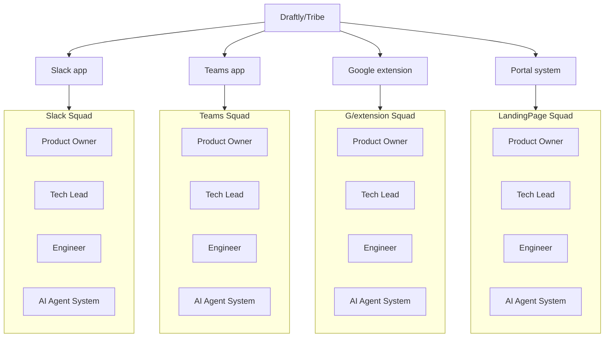
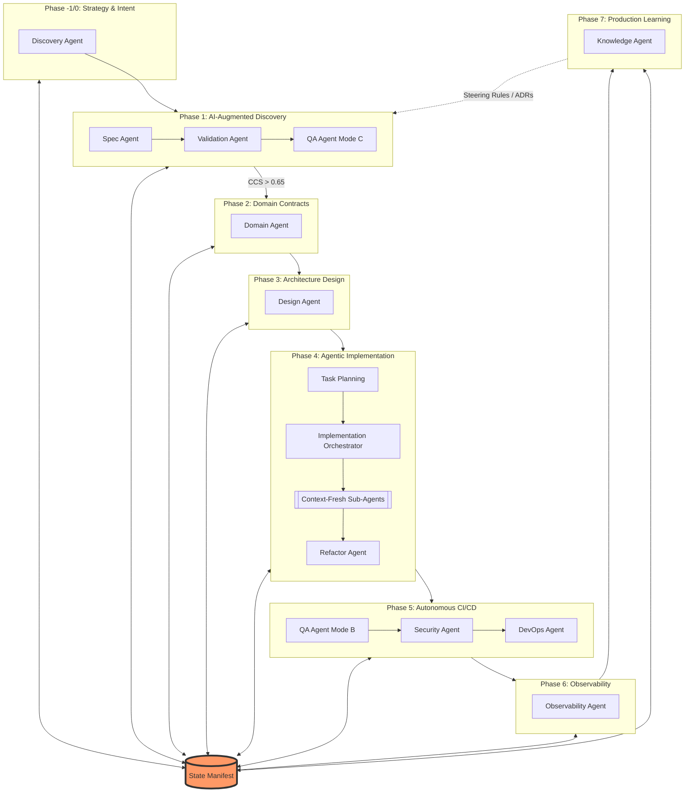
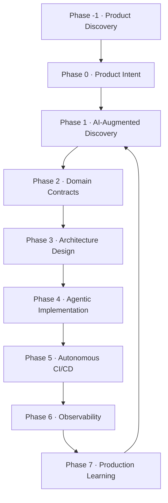

# Agentic Specification-Driven Development Framework

Version: 5.0  
Year: 2026  
Audience: Engineering Leaders, Product Owners, AI Engineers, Architects  
Author: Edwin Encinas  

---

# Abstract

Software engineering is entering a new era where **AI agents actively participate in the development lifecycle**. Traditional agile methodologies were designed for human-only teams and are not optimized for AI-augmented environments.

This document introduces **Agentic Specification-Driven Development (ASDD)** — a framework for building software using **AI-assisted specifications, autonomous agents, and production learning loops**.

ASDD enables small engineering teams to achieve dramatically higher output while maintaining architecture quality, security, and system observability.

---

# 1. Introduction

## 1.1 Traditional Agile bundaries

Most modern software teams use frameworks such as Scrum and Kanban. These frameworks focus on human collaboration, incremental delivery, and iterative planning. However, they assume that **software is primarily written by humans**.

AI-augmented development introduces new challenges that traditional agile processes do not address:

- AI hallucinations
- Architectural drift
- Inconsistent code generation
- Lack of specification traceability
- Agent failure modes and recovery
- Human-AI decision conflicts

---

# 2. The Rise of AI-Native Engineering

Modern development environments increasingly integrate AI capabilities such as code generation, automated testing, architecture suggestions, and CI/CD automation. Examples include tools such as Kiro IDE, Jira with Rovo AI, and GitHub Copilot.

These tools represent an evolution toward **agentic software development**, where AI participates actively in the engineering lifecycle.

---

# 3. What Is ASDD?

**Agentic Specification-Driven Development (ASDD)** is a framework that combines:

- Specification-driven development
- AI agent orchestration
- Automated validation pipelines
- Production feedback learning
- Formal human-AI governance

ASDD solves the core challenges modern software teams face: ambiguous requirements, inconsistent architectures, fragmented documentation, slow delivery cycles, agent failures, and scaling engineering teams.

## 3.1 The Core Idea

> Specifications become the central artifact that coordinates humans and AI.

Instead of starting with code, development begins with **structured, machine-interpretable specifications**. Agents operate within clearly defined boundaries, and humans retain formal authority to override, reject, or escalate any agent decision.

## 3.2 Conceptual Flow

```
Idea → Specification → Architecture → AI Implementation → Validation → Deployment → Production Learning
```

## 3.3 Layers

- **Product Layer:** Defines strategic intent and product goals.
- **Specification Layer:** Executable artifacts describing requirements and domain models.
- **Agent Execution Layer:** AI agents transform specifications into architecture, tests, and code.
- **Governance Layer:** Human override protocols, audit trails, and conflict resolution rules.
- **Platform Layer:** Infrastructure enabling automation, CI/CD, and observability.

---

# 4. Core Principles

ASDD is built on eight principles.

## 4.1 Ambiguity Is a Bug

Ambiguous requirements cause misinterpretation, inconsistent implementations, and AI hallucinations. ASDD enforces **machine-interpretable specifications** validated by automated gates before any agent consumes them.

## 4.2 Specifications Are Executable

Specifications are not passive documentation. They generate tests, architecture, validation rules, and API contracts.

## 4.3 AI Is a Pilot, Not a Passenger

AI agents actively participate in development. Humans remain responsible for product vision, governance, and architectural decisions. When AI and human judgment conflict, the human decision prevails — and the conflict is logged.

## 4.4 Contracts Over Code

Each phase of the lifecycle produces **formal contracts** (API, Domain, or Architecture). Examples include requirements contracts, domain models, API contracts, and architecture contracts.

## 4.5 Production Data Evolves the System

Systems continuously learn from telemetry, user behavior, and system failures — within formally defined safety boundaries.

## 4.6 Small Teams + AI Scale Engineering Capacity

ASDD assumes **small squads augmented by AI agents**. A typical squad contains 3 humans and 6–10 AI agents.

## 4.7 Agents Fail — Design for Recovery

> Agent failure is not an edge case; it is a guaranteed operational condition.

Every agent pipeline must define confidence thresholds, rollback procedures, and escalation paths. No agent decision with a confidence score below the defined threshold is acted upon without human review.

## 4.8 Humans Retain Override Authority

Any team member — engineer, Tech Lead, or Product Owner — may formally reject or escalate an agent-produced artifact at any phase gate. The framework provides a structured dissent mechanism with an audit trail, not an informal veto.

---

# 5. Organizational Model

ASDD adopts the **squad-based structure popularized by Spotify engineering culture**. Each squad owns a specific domain and operates independently while following shared architectural governance.



## 5.1 Tribe (Product Areas)

Large systems are divided into **Tribes / product areas** — groups of squads working on a domain with shared standards, tooling, and architecture.

## 5.2 Squads

Each product area contains several **squads** owning a business capability end-to-end.

## 5.3 Squad Composition

| Role | Count | Accountability |
|---|---|---|
| Product Owner (Shared) | 0.5 FTE | Strategic Intent and Business Specs |
| Tech Lead | 1 | Technical integrity and ASDD flow |
| Engineers | 1–3 | Agent orchestration and spec-fidelity |
| AI Agent System | 6–10 | Implementation, QA, and DevOps execution |

> One Product Owner may serve **2–3 squads**, depending on complexity.

## 5.4 Roles & Responsibilities

### 5.4.1 Product Owner (PO)

**Primary Accountability:** *Meaning and Business Value*

Responsibilities:
- Owns **Capability Specs** (not tasks)
- Defines business rules, constraints, and success metrics
- Prioritizes specs in the backlog
- Validates specs before approval
- Accepts outcomes based on spec compliance
- Exercises formal override authority when agent outputs conflict with business intent

**What the PO no longer does:**
- Write detailed user stories
- Clarify requirements during sprints
- Negotiate scope mid-sprint

### 5.4.2 Tech Lead (TL)

**Primary Accountability:** *Flow, Quality, and Technical Integrity*

Responsibilities:
- Enforces SDD workflow and phase gates
- Facilitates sprint ceremonies
- Ensures specs are implementation-ready before sprint start
- Owns technical coherence and architecture
- Resolves agent escalations requiring human judgment
- Maintains the Agent Failure Log (see Section 6.3)
- Coaches the team in ASDD practices

### 5.4.3 Engineers (1–3 Developers)

**Primary Accountability:** *Execution and Spec Fidelity*

Responsibilities:
- Implement exactly what is defined in the spec
- Identify spec gaps **before sprint start**
- Write tests mapped to spec behaviors
- Emit events, logs, and metrics as defined
- Reject undocumented behavior
- File formal dissent notices when agent output is technically unsafe (see Section 6.4)

#### 5.4.3.1 Engineer Core Principles

1. **Specs before Sprints** — No work enters a sprint without an approved spec
2. **Single Source of Truth** — Specs replace scattered user stories and acceptance criteria
3. **Autonomous Squads** — Each squad owns a business capability end-to-end
4. **Role Clarity** — Clear accountability eliminates handoffs and delays
5. **Flow Efficiency** — Optimize for fast, stable delivery over resource utilization

## 5.5 Governance & Decision Rights

| Decision | Owner |
|---|---|
| Business priority | Product Owner |
| Spec approval | PO + TL |
| Technical approach | TL |
| Implementation details | Developers |
| Agent output rejection | Any team member (via Dissent Protocol) |
| Agent escalation resolution | Tech Lead |
| Self-Healing PR approval | TL + at least one Engineer |

---

# 6. AI Agent Architecture

ASDD defines specialized agents for different responsibilities.

## 6.1 Core Agents

| Agent | Responsibility |
|---|---|
| Discovery Agent | Structured software requirements from raw input |
| Spec Agent | Requirement formatting and EARS compliance |
| Validation Agent | Ambiguity detection and spec quality scoring |
| Design Agent | Architecture synthesis from domain contracts |
| Implementation Agent | Code generation within spec boundaries |
| QA Agent | Automated test generation mapped to spec behaviors |
| Security Agent | Security policy enforcement against steering rules |
| Observability Agent | Telemetry integration and production anomaly detection |
| DevOps Agent | CI/CD pipeline automation |
| Knowledge Agent | System memory, pattern learning, and steering rule evolution |

## 6.2 AI Agent Orchestration Pipeline



### 6.2.1 Purpose

The agent pipeline transforms:

```
intent → specifications → domain model → architecture → task waves → code → validated system
```

Each agent produces artifacts stored in the repository. Each transition between agents is a **phase gate** — artifacts are validated against the **State Manifest** (`.kiro/state/manifest.json`) before being passed downstream.

---

## 6.3 Agent Failure Protocol

> Agent failure is a guaranteed operational condition, not an edge case. Every agent must be designed to fail safely.

### 6.3.1 Confidence Thresholds and Cascade Guardrails

Each agent must emit a **confidence score** (0.0–1.0) alongside every artifact it produces. Thresholds are defined per agent in `.kiro/steering/agent-thresholds.md`.

#### Confidence Thresholds
| Agent | Default Minimum Confidence | Action if Below Threshold |
|---|---|---|
| Spec Agent | 0.85 | Flag ambiguous sections, route to human |
| Validation Agent | 0.90 | Block pipeline, require TL sign-off |
| Design Agent | 0.80 | Draft architecture, require TL review before proceeding |
| Implementation Agent | 0.75 | Commit to feature branch, require human code review |
| Security Agent | 0.95 | Block deployment, require TL + Security review |
| Knowledge Agent | 0.80 | Propose steering update, require human approval |

#### 6.3.2 Cumulative Confidence Guardrail (The Cascade Protector)
To prevent "Cascading Confidence Failures"—where multiple agents pass their individual gates but with scores just above the minimum—ASDD enforces a **Product Law of Confidence**.

1. **Cumulative Score Calculation:** The `Cumulative Confidence Score (CCS)` for a slice is the product of all agent confidence scores in the current pipeline path:
   `CCS = (Conf_Spec) * (Conf_Validation) * (Conf_Design) * (Conf_Implementation)`
2. **Cumulative Threshold:** Regardless of individual scores, if the `CCS` drops below **0.65**, the pipeline triggers an `AUTOMATIC_RECOVERY_HALT`.
3. **Dynamic Gating:** If a preceding agent provides a low (but passing) score, the next agent's minimum threshold is automatically increased by **+0.05** to compensate for the "uncertainty debt."
4. **Uncertainty Breakdown:** Agents are required to explicitly list **"Uncertainty Factors"** if their score is < 0.95. This allows the Tech Lead to quickly identify the weak link in a low-CCS slice.

### 6.3.3 Failure Modes and Responses

| Failure Mode | Detection | Response |
|---|---|---|
| Hallucinated spec section | Validation Agent detects undefined domain terms | Block pipeline, flag section, notify TL |
| Conflicting agent outputs | Design Agent output contradicts domain contract | Pause pipeline, log conflict, escalate to TL |
| Agent timeout / crash | Pipeline monitor detects no output after N minutes | Retry once, then escalate to TL |
| Contradictory steering rules | Security Agent detects rule conflict | Block deployment, log conflict, notify TL |
| Infinite refinement loop | Pipeline monitor detects same artifact version 3+ times | Force-halt pipeline, escalate to TL |
| Cascading Confidence Failure | Cumulative Confidence Score (CCS) < 0.65 | Halt pipeline, require full human review of all artifacts in slice |
| Low-confidence cascade | Two or more consecutive agents below threshold | Halt pipeline, require full human review of phase |

### 6.3.3 Rollback Procedure

When a pipeline halt is triggered:

1. The current phase's artifact is marked `DRAFT — AGENT HALTED`.
2. All downstream agents are paused.
3. The Tech Lead receives an automated escalation notice with the agent's confidence score, the conflicting artifacts, and the failure mode category.
4. The TL either resolves the conflict manually, returns the artifact to an earlier phase, or approves a revised agent run.
5. The resolution decision and rationale are logged in `/docs/agent-failure-log.md`.

### 6.3.4 Agent Failure Log

The Tech Lead maintains `/docs/agent-failure-log.md` with the following schema per entry:

```
Date | Agent | Phase | Failure Mode | Confidence Score | Resolution | Time to Resolve | Root Cause
```

This log feeds the Knowledge Agent's learning loop (see Section 10.3).

---

## 6.4 Human Override and Dissent Protocol

Any team member may formally reject an agent-produced artifact at any phase gate. This is not an informal veto — it is a structured protocol with an audit trail.

### 6.4.1 Filing a Dissent Notice

A dissent notice is filed by creating an entry in `/docs/dissent-log.md` with the following fields:

```
Date | Author | Phase | Artifact Rejected | Reason Category | Detailed Rationale | Proposed Resolution
```

**Reason categories:**
- `TECHNICALLY_UNSAFE` — Agent output introduces architectural risk or security vulnerability
- `SPEC_NONCOMPLIANT` — Agent output does not match the approved spec
- `BUSINESS_MISALIGNED` — Agent output conflicts with stated product intent
- `HALLUCINATION_SUSPECTED` — Agent output references undefined domain concepts
- `QUALITY_UNACCEPTABLE` — Agent output is technically compliant but unmaintainable

### 6.4.2 Resolution Authority

| Reason Category | Resolution Owner | SLA |
|---|---|---|
| `TECHNICALLY_UNSAFE` | Tech Lead | Same sprint day |
| `SPEC_NONCOMPLIANT` | Tech Lead | Same sprint day |
| `BUSINESS_MISALIGNED` | Product Owner | Next planning session |
| `HALLUCINATION_SUSPECTED` | Tech Lead | Same sprint day |
| `QUALITY_UNACCEPTABLE` | Tech Lead + Engineer | Within sprint |

### 6.4.3 Override Audit Trail

All override decisions are immutable log entries. They cannot be deleted. The Knowledge Agent monitors override frequency by agent, phase, and reason category to detect systematic agent weaknesses.

---

# 7. The ASDD Lifecycle

ASDD defines an eight-phase lifecycle.



---

## Phase −1 — Product Discovery

**Purpose:** Validate the problem before building solutions.

**Artifacts:**

- Product: `problem-space.md`, `personas.md`, `success-metrics.md`, `PRD.md`
- Architecture: `architecture.md`, `c4model diagrams`, `standards.md`

**Exit Gate:** PO and TL sign off that the problem space is sufficiently understood to warrant specification work.

---

## Phase 0 — Product Intent Modeling

Defines the strategic purpose of the product.

**Artifact:** `intent.md`

**Required Sections:**
```
Mission
Capabilities
Success Metrics
Non-Goals
```

**Exit Gate:** PO approves `intent.md`. No Phase 1 work begins without an approved intent document.

---

## Phase 1 — AI-Augmented Discovery (Behavioral Slicing)

Feature ideas become formal requirements via the Discovery Agent and Spec Agent. To avoid waterfall bottlenecks, ASDD uses **Behavioral Slicing** and **Agile Governance** to reduce Human-in-the-Loop (HITL) latency.

**Artifact:** `requirements.md`

Requirements must be:
- **Categorized:** [FEATURE | BUG | IMPROVEMENT | MODULE | PRODUCT]
- **Sized:** Every requirement must belong to a **Slice** (e.g., MVP, V1, V2).
- **Risk-Assessed:** Requirements are flagged as [LOW | HIGH] risk by the Validation Agent.
- **Atomic:** One requirement describes exactly one behavior.
- **Testable:** Evaluated via the QA Agent.
- **Written in EARS format.**

### 7.1 Spec Validation Gate (JIT Validation & Agile Governance)

The Spec Validation Gate is **Just-in-Time (JIT)**. Requirements move through the pipeline in **slices**, not wholesale. To minimize human latency, the following governance models are supported:

1. **Delegated Authority (Auto-Approval):** For **LOW RISK** requirements in **BUG** or **IMPROVEMENT** categories, if the Validation Agent confidence score is ≥ 0.95, the requirement is auto-approved for implementation.
2. **Asynchronous Approval (RFC Mode):** The Tech Lead (TL) and Product Owner (PO) use an RFC-style process. Agents post proposals, and humans have a defined "SLA" window to dissent. No dissent within the window = implicit approval for the next stage.
3. **AI-Assisted Peer Review:** Before hitting the human TL, the **QA Agent** must "peer-review" the Spec Agent's output. Only "Peer-Approved" specs reach the human, reducing noisy review cycles.

**Gate checks:**
- **Category Check:** Requirement is correctly typed.
- **Slice Assignment:** Requirement is assigned to an active slice.
- **EARS syntax compliance** (automated linter).
- **Domain term resolution** — every noun in the requirement must exist in the current `domain-model.md`.
- **Testability score ≥ 0.80** (Validation Agent).
- **Risk Score Assignment** (Validation Agent).

**Gate failure behavior:**
- The failing requirement is marked `BLOCKED — VALIDATION FAILED`.
- Other requirements in the same **Slice** may proceed if they pass, but the Slice status remains `PARTIAL` until all MUST requirements pass.
- The Validation Agent emits a structured failure report.
- No blocked requirement may enter a sprint.

**Resolution ownership:** The Tech Lead and Product Owner collaborate to re-prioritize or re-slice requirements when validation fails. For auto-approved slices, the Knowledge Agent monitors for "Regret Metrics" to refine future auto-approval thresholds.

---

## Phase 2 — Domain Contracts

Defines the shared domain language that all agents and humans use. This is the vocabulary contract for the system.

**Artifact:** `domain-model.md`

### 7.2 Domain Model Schema*

The domain model is **not a free-form markdown file**. It must conform to the following schema to be machine-consumable by downstream agents:

```yaml
# domain-model.md schema (YAML front matter + structured sections)

domain: <domain name>
version: <semver>
last_updated: <ISO date>
owner: <Tech Lead name>

entities:
  - name: <EntityName>
    description: <one sentence>
    attributes:
      - name: <attribute>
        type: <primitive or reference>
        required: <true|false>
        description: <one sentence>
    invariants:
      - <business rule that must always hold>

value_objects:
  - name: <ValueObjectName>
    description: <one sentence>
    attributes: [ ... ]

aggregates:
  - root: <EntityName>
    members: [ <EntityName>, ... ]

domain_events:
  - name: <EventName>
    trigger: <what causes this event>
    payload: [ <attribute>, ... ]

ubiquitous_language:
  - term: <Term>
    definition: <definition>
    aliases: [ <alias>, ... ]
```

The Spec Agent uses the `ubiquitous_language` section to validate requirement terminology in Phase 1. The Design Agent uses entities, aggregates, and domain events to synthesize architecture in Phase 3.

**Exit Gate:** TL approves schema-compliant `domain-model.md`. Non-compliant files are rejected by the CI gate.

---

## Phase 3 — Architecture Design

The Design Agent synthesizes architecture from the approved domain contracts and requirements.

**Artifact:** `design.md`

**Required Contents:**
```
Architecture overview
Component boundaries
Database schema (ERD or equivalent)
Sequence diagrams for critical flows
Non-functional requirements addressed
Security surface analysis
```

Architecture rules are enforced using **AI guardrails via `.kiro/steering/` files** (see Section 9 for the enforcement model).

**Exit Gate:** TL reviews and approves `design.md`. Architecture must be traceable to at least one requirement in `requirements.md`.

---

## Phase 4 — Agentic Implementation (Waves & Sub-Agents)

The Implementation Agent generates tasks and implements code using **Execution Waves** and **Context-Fresh Sub-Agents**.

**Artifact:** `tasks.md` (Markdown-based, trace-friendly)

**Workflow:**

```
RED   → Implementation Agent writes failing tests mapped to spec behaviors
GREEN → Implementation Agent implements logic to pass tests
REFACTOR → Implementation Agent improves code quality within spec boundaries
```

Every implementation task must reference the spec requirement it satisfies. Code that introduces behavior not defined in any spec requirement is flagged as `UNDOCUMENTED_BEHAVIOR` and blocked from merge.

**Exit Gate:** QA Agent confirms test coverage ≥ threshold (defined in `.kiro/steering/quality-gates.md`). Security Agent runs compliance scan. Human code review required when Implementation Agent confidence < 0.75.

---

## Phase 5 — Autonomous CI/CD

CI pipelines automatically validate:
- Specification coverage (every requirement has at least one test)
- Test coverage (configurable minimum, default 80%)
- Security compliance (policy gates — see Section 9)
- Agent confidence scores logged and reviewed

**Human gate:** Any pipeline failure requires Tech Lead acknowledgment before the pipeline can be force-bypassed. Force-bypasses are logged immutably.

---

---

## Phase 6 — Observability (The Continuous Sensor)

**Purpose:** Ensure the system is measurable and errors are detectable in real-time.

**Artifacts:** `telemetry-plan.md`, `dashboards.json`, `alerts.yaml`

Systems must expose telemetry for performance monitoring, error detection, and usage analytics. The Observability Agent instruments the system and validates that all defined telemetry points are emitting correctly.

**Required telemetry per service:**
- API latency (p50, p95, p99)
- Error rate by type
- Transaction success/failure counts
- Business event counts (mapped to domain events from `domain-model.md`)

**Exit Gate:** Observability Agent confirms telemetry emission from all new components.

---

---

## Phase 7 — Production Learning Loop

The system is self-correcting within formally defined safety boundaries.

### 7.3 Learning Loop Process

1. **Detection:** The Observability Agent identifies a bottleneck, recurring error, or anomalous pattern.
2. **Analysis:** The Knowledge Agent correlates the pattern against known failure modes and prior dissent log entries.
3. **Proposal:** The Knowledge Agent proposes a steering rule update in a `DRAFT` PR.
4. **Human Approval Gate:** TL and at least one Engineer review and approve or reject the proposal.
5. **Evolution:** On approval, `.kiro/steering/` is updated.
6. **Refactor:** Self-Healing PRs are opened to align existing code with the new rule.

### 7.4 Self-Healing PR Safety Gates *(New in v5.0)*

Self-Healing PRs carry elevated risk because they are agent-initiated changes to production code. The following constraints are mandatory:

**Scope limits:**
- A Self-Healing PR may not modify more than **3 files** per PR.
- A Self-Healing PR may not touch authentication, authorization, payment, or data-access code without explicit TL approval flagged in the PR.
- A Self-Healing PR may not delete any code — only add or modify.

**Approval requirements:**
- Mandatory review by the Tech Lead.
- At least one Engineer must approve.
- CI must pass fully — no force-bypass permitted on Self-Healing PRs.

**Rollback policy:**
- Every Self-Healing PR must include a documented rollback procedure in the PR description.
- If a Self-Healing PR is reverted, the Knowledge Agent's proposed steering update is also reverted and flagged for re-analysis.

**Audit:** All Self-Healing PRs are tagged `self-healing` in the repository and listed in `/docs/self-healing-log.md` with outcome and revert status.

---

# 8. Sprint Cadence

The ASDD sprint cadence adapts agile rhythms to account for both human and agent work streams.

## 8.1 Sprint Structure

**Recommended cadence:** 2-week sprints.

| Day | Activity |
|---|---|
| Day 1 (Monday) | Sprint Planning — PO presents approved specs; TL confirms all specs have passed the Validation Gate; team selects work; agent task queues are configured |
| Day 1–9 | Execution — Agents execute implementation loop; humans orchestrate agents, review outputs, file dissent notices as needed |
| Day 5 (Friday) | Mid-sprint sync — TL reviews agent confidence log; any pipeline halts are resolved or escalated |
| Day 9 (Thursday) | Sprint Review — Demo against spec acceptance criteria; PO accepts or rejects outcomes based on spec compliance |
| Day 10 (Friday) | Retrospective — Team reviews dissent log, agent failure log, and override frequency; learnings fed to Knowledge Agent |

## 8.2 Agent Work-in-Progress Limits

To prevent agent queues from growing unbounded, each agent has a defined WIP limit:

| Agent | Max Concurrent Tasks |
|---|---|
| Spec Agent | 5 requirements |
| Design Agent | 1 architecture per squad |
| Implementation Agent | 3 features |
| QA Agent | 10 test suites |
| Security Agent | 1 full scan per deployment |

Tasks exceeding WIP limits are queued and not started until an in-progress task completes or is halted.

## 8.3 Spec Readiness Definition

A spec is **sprint-ready** when all of the following are true:
- Spec Validation Gate passed (Phase 1 exit)
- Domain model contains all referenced entities (Phase 2 complete)
- Architecture design references the spec (Phase 3 exit)
- No open dissent notices against the spec
- TL has signed off

No spec-unready work enters a sprint under any circumstances.

---

# 9. Security Enforcement Layer

The security model in ASDD is **not based on markdown rules alone**. Guardrail rules stored in `.kiro/steering/` are the *specification* — enforcement happens at multiple automated layers.

## 9.1 Enforcement Architecture

```
.kiro/steering/security-rules.md  ←  Human-readable source of truth
         ↓
CI Security Gate (automated policy scanner)
         ↓
Security Agent (pre-deployment compliance scan)
         ↓
Production monitoring (runtime policy enforcement)
```

## 9.2 Rule Categories (TBD wth new architecture or dependent team guidelines)

**Structural rules** (enforced by static analysis in CI):
- Business logic must reside in service classes, not controllers
- Controllers may not access database repositories directly
- Authentication middleware must be present on all non-public routes

**Behavioral rules** (enforced by Security Agent scan):
- Authentication must not be bypassable via query parameter or header manipulation
- Secrets must not appear in logs, error messages, or API responses
- All external inputs must be validated before use

**Deployment rules** (enforced by DevOps Agent gate):
- No deployment proceeds with a Security Agent confidence score < 0.95
- All production deployments require a security scan artifact attached to the pipeline run
- Critical vulnerabilities block deployment; high vulnerabilities require TL sign-off

## 9.3 Rule Management

Steering rules in `.kiro/steering/security-rules.md` may only be modified via a PR approved by both the Tech Lead and — for rules in the `CRITICAL` category — a designated security reviewer. Rule changes are versioned and logged.

---

# 10. Knowledge Agent Specification

The Knowledge Agent is the most consequential and previously least-specified component in ASDD. This section defines it formally.

## 10.1 Responsibilities

- Maintain a persistent, versioned store of architectural decisions, agent failure patterns, and resolved dissent notices
- Analyze production telemetry to identify emergent failure patterns
- Propose steering rule updates based on observed patterns
- Track override frequency by agent and reason to detect systematic agent weaknesses
- Bootstrap the system's knowledge base from legacy codebase analysis (see Section 12.2)

## 10.2 State Storage Model (TBD)

The Knowledge Agent's state is stored in `/docs/knowledge-base/` with the following structure:

```
/docs/knowledge-base/
  architectural-decisions/    # ADR format, one file per decision
  failure-patterns/           # Identified patterns with frequency and context
  steering-proposals/         # Proposed rule changes, status (DRAFT/APPROVED/REJECTED)
  override-analysis/          # Aggregated override trends by agent and category
  lessons-learned.md          # Human-readable summary, updated each sprint
```

All entries are append-only. The Knowledge Agent may not delete entries — only mark them `SUPERSEDED`.

## 10.3 Error Compounding Prevention

The Knowledge Agent learns from production data, but learning from a statistical anomaly can introduce systematic errors. The following controls prevent error compounding:

- A pattern must be observed in **at least 3 separate production incidents** before a steering rule update is proposed.
- Proposed rule updates must not contradict any currently approved ADR (architectural decision record) without explicitly referencing and justifying the ADR change.
- After a Self-Healing PR is merged, the Knowledge Agent monitors the specific metric it was meant to improve for 7 days. If the metric does not improve, the PR is flagged for reversion review.

## 10.4 Learning Validation

Before any Knowledge Agent proposal is presented to the human approval gate, it must include:
- The pattern data that triggered the proposal (minimum 3 incidents)
- The specific steering rule text being proposed
- The predicted outcome and how it will be measured
- The rollback plan if the change worsens the metric

---

# 11. Repository Architecture

ASDD standardizes repository structure.

```
/agents                         # Custom agent prompts, tools, and threshold configs
/docs
  /architecture                 # Arc42/C4 Model diagrams
  /knowledge-base/              # Knowledge Agent state (see Section 10.2)
  /agent-failure-log.md         # Agent Failure Log (see Section 6.3.4)
  /dissent-log.md               # Dissent notices and resolutions (see Section 6.4)
  /self-healing-log.md          # Self-Healing PR audit trail (see Section 7.4)
  /spec-resolution-log.md       # Ambiguity resolution decisions from Phase 1
  /lessons-learned.md           # Human-readable sprint retrospective summaries
/.kiro
  /specs                        # Ready-for-dev Capability Specs
  /steering                     # Architectural, Security, and Quality Guardrails
    /security-rules.md
    /quality-gates.md
    /agent-thresholds.md
    /architecture-rules.md
/src                            # Agent-generated implementation
/infra                          # IaC (Terraform / Pulumi / AWS CDK)
```

This structure ensures traceability between:

```
intent → capability → requirements → architecture → code → production behavior
```

---

# 12. Legacy Migration Guide

Most real-world squads inherit existing codebases, not greenfields. ASDD is applicable to legacy systems via a structured retro-specification approach.

## 12.1 The Retro-Spec Playbook

**Phase A — Codebase Archaeology (2–4 weeks)**

The Knowledge Agent analyzes the existing codebase to produce a draft `domain-model.md` and a draft `architecture.md`. Engineers validate and correct the drafts. This produces the baseline knowledge state.

Deliverables: `domain-model.md` (draft, engineer-validated), `architecture.md` (draft, TL-validated)

**Phase B — Behavior Capture (2–4 weeks)**

The QA Agent analyzes existing tests (if any) and the Discovery Agent reads documentation, commit messages, and issue trackers to produce draft `requirements.md` entries for existing functionality.

Engineers review each requirement draft: mark it `VALIDATED` (behavior is correctly described), `CORRECTED` (behavior exists but description was wrong), or `MISSING` (behavior exists but was not captured).

Deliverables: `requirements.md` with status per requirement

**Phase C — Gap Analysis (1 week)**

The Validation Agent runs the Spec Validation Gate against the retro-specified requirements. All failures are logged. The TL prioritizes which failures to address before enabling the agentic pipeline.

Deliverables: Prioritized spec remediation backlog

**Phase D — Incremental ASDD Adoption**

New features follow the full ASDD lifecycle. Legacy code is brought into spec compliance incrementally, one domain area per quarter, prioritized by change frequency (highest-change areas first).

## 12.2 Knowledge Agent Bootstrap for Legacy Systems

For legacy codebases, the Knowledge Agent's initial state is populated by:

1. Static analysis of the codebase for architectural patterns and violations
2. Commit history analysis for recurring failure areas
3. Issue tracker scraping for reported bugs and their resolution patterns
4. Any existing documentation, however incomplete

This bootstrap produces an initial `failure-patterns/` set that gives the Knowledge Agent a starting point rather than a blank slate.

---

# 13. Metrics

ASDD tracks engineering effectiveness through two tiers of metrics.

## 13.1 Primary Metrics

| Metric | Purpose | Calculation |
|---|---|---|
| Spec Coverage | Implementation completeness | % of approved requirements with ≥1 passing test |
| Test Coverage | Reliability | % of production code covered by tests |
| Spec-to-Ship Time | Development speed | Time from spec approval to production deployment |
| Production Error Rate | System quality | Error events per 1,000 transactions |
| AI Refactor Frequency | Architecture health | Self-Healing PRs merged per sprint |

## 13.2 Second-Order Metrics

Primary metrics can produce misleading signals when agent quality is poor. These second-order metrics detect systemic problems that primary metrics miss.

| Metric | Purpose | Warning Signal |
|---|---|---|
| Spec Quality Score | Detect low-quality specs that pass the gate | Score < 0.80 for >20% of specs in a sprint |
| Agent Confidence Distribution | Detect degrading agent performance | Median confidence falling sprint-over-sprint |
| Hallucination Rate | Detect domain terminology errors in agent output | >2 per sprint per agent |
| Human Override Frequency | Detect agents operating outside their competence | >3 overrides per sprint per agent |
| Spec Validation Gate Failure Rate | Detect upstream ambiguity problems | >30% of specs failing the gate |
| Self-Healing PR Revert Rate | Detect unstable learning loop | >1 revert per 5 Self-Healing PRs |
| Time to Resolve Agent Escalation | Detect TL bottlenecks | >4 hours for `TECHNICALLY_UNSAFE` category |

Second-order metrics are reviewed in the sprint retrospective and fed to the Knowledge Agent for pattern analysis.

---

# 14. Change Management Playbook

Adopting ASDD is an organizational transformation, not just a tooling change. This section provides a structured approach to managing that transition.

## 14.1 Role Transition Guidance

| Current Role | ASDD Role | Key Mindset Shift | Support Needed |
|---|---|---|---|
| Senior Developer | Engineer / Agent Orchestrator | From writing code to directing agents and validating their output | Training in spec writing, EARS format, agent configuration |
| Junior Developer | Engineer | From learning by doing to learning by spec-fidelity review | Pairing with TL; close mentorship in ASDD lifecycle |
| Product Manager | Product Owner | From story-writing to capability-spec authorship | Training in domain modeling, EARS format; reduced to 0.5 FTE per squad |
| Tech Lead | Tech Lead | Adds agent governance to existing responsibilities | Training in agent threshold configuration, failure protocol |
| QA Engineer | QA Agent Operator | From manual test writing to QA Agent orchestration and test review | Training in automated test generation validation |

## 14.2 Adoption Sequencing

Do not attempt to adopt all ASDD phases simultaneously. The following sequence minimizes disruption:

**Quarter 1:** Introduce spec-driven requirements only. Teams continue coding as before, but all new work requires an approved `requirements.md` entry before starting.

**Quarter 2:** Introduce the Spec Validation Gate and the Domain Model. Teams write domain models and experience automated spec feedback for the first time.

**Quarter 3:** Introduce the Implementation Agent for new features only. Existing code is not touched. Engineers review all agent output.

**Quarter 4:** Introduce the full agent pipeline, CI security gates, and the Knowledge Agent (in observation-only mode — no steering updates yet).

**Year 2:** Enable Self-Healing PRs (with all safety gates from Section 7.4 active). Begin retro-specification of legacy code.

## 14.3 Resistance Patterns and Responses

| Resistance Pattern | Response |
|---|---|
| "Agents can't replace my judgment" | Correct — they don't. Override authority is formally yours (Section 6.4). Agents assist; you govern. |
| "I don't trust code I didn't write" | All agent-generated code requires human review at confidence < threshold. Start with code review of every agent output until trust is established. |
| "Writing specs takes longer than coding" | True at first. Measure the time saved on rework, unclear requirements, and production incidents. Track Spec-to-Ship Time after 2 sprints. |
| "We don't have time to learn this" | Phase the adoption (Section 14.2). Quarter 1 adds only one new practice. |

## 14.4 Vendor Independence

ASDD's repository architecture currently maps closely to Kiro IDE conventions (`.kiro/specs`, `.kiro/steering`). Teams using other toolchains should treat the following as **framework-agnostic concepts** that map to their tooling:

| ASDD Concept | Kiro Convention | Generic Equivalent |
|---|---|---|
| Capability Specs | `.kiro/specs/*.md` | Any structured spec directory |
| Steering rules | `.kiro/steering/*.md` | Linting rules, policy-as-code files |
| Agent pipeline | Kiro agent hooks | Any agent orchestration framework |
| Phase gates | Kiro workflow gates | CI/CD stage gates |

Teams not using Kiro should define a `toolchain-portability.md` in their repository mapping ASDD concepts to their specific tools. The framework's value is in the *process*, not the file paths.

---

# 15. Maturity Model

Organizations adopt ASDD gradually. Each level now includes the gap resolutions required to advance.

| Level | Description | Required Capabilities Before Advancing |
|---|---|---|
| L1 | AI-assisted coding | Basic AI code completion in use; no formal specs required |
| L2 | AI-assisted testing | QA Agent generating tests; spec coverage metric established |
| L3 | Specification-driven development | Spec Validation Gate active; Domain Model schema in use; sprint cadence defined |
| L4 | Agentic implementation | Agent Failure Protocol active; Dissent Protocol in use; Security Enforcement Layer live |
| L5 | Autonomous delivery | Knowledge Agent in operation; Self-Healing PRs enabled with all safety gates; second-order metrics tracked |
| L6 | Self-evolving systems | Full production learning loop active; override frequency < 1 per agent per sprint; revert rate < 10% |

---

# 16. Benefits of ASDD

Organizations adopting ASDD gain:

- Faster feature delivery through specification parallelism (agents work while humans plan the next spec)
- Improved architecture consistency through formal contracts and automated guardrails
- Automated validation that catches errors before they reach production
- Reduced engineering overhead on routine implementation tasks
- A systematic, auditable record of every decision — human and agent
- The ability for small squads to build systems traditionally requiring much larger teams

---

## 17.1 Roadmap: Recommendations for the Next Evolution

To further reduce bottlenecks and improve autonomous quality, ASDD v6.0 will focus on the following three architectural evolutions:

### 1. Automated Uncertainty Resolution (Spike Agents)
When an agent reports low confidence and lists **Uncertainty Factors** (Section 6.3.2), the pipeline can trigger a **Discovery Spike Agent**. 
- **Action:** This agent performs a "Zero-Spec Implementation" or "Documentation Search" to gather evidence.
- **Outcome:** The evidence is fed back to the original agent to resolve the uncertainty and increase the confidence score without human intervention.

### 2. Cross-Slice Dependency Graph
As slices move through the pipeline independently, the **Knowledge Agent** will maintain a real-time graph of shared domain entities and system components.
- **Action:** Detect conflicts where Slice A and Slice B modify the same entity or component in incompatible ways.
- **Outcome:** Proactive "Conflict Alerts" that halt only the affected slices before they reach the Implementation phase.

### 3. Human-in-the-Loop "Chat-to-Manifest" Interface
To lower the barrier for POs and TLs, the **Knowledge Agent** will expose a natural language interface to the State Manifest.
- **Action:** Humans can ask "What's the status of Slice-001?" or "Approve all low-risk bug fixes in the current sprint" via chat.
- **Outcome:** The agent translates these intents into machine-readable updates to `.kiro/state/manifest.json`, ensuring the system state and human intent remain perfectly synchronized.

---

## 18. Agentic State Management (The Backbone)

To prevent "State Fragmentation" in multi-agent orchestration, ASDD uses a **Manifest-based State Management** model. This ensures a single source of truth for the project's health and pipeline status. This manifest serves as the **Stateful Interface** shown in the center of the agent orchestration flow.

## 18.1 The State Manifest (`.kiro/state/manifest.json`)

All agentic activities are tracked in a centralized, machine-readable manifest. This manifest is the "Heartbeat" of the project.

**Core Data Schema:**
- `project_context`: Current sprint, product goals, and global confidence scores.
- `slices`: An array of all active behavioral slices (FEATURE, BUG, etc.).
  - `slice_id`: Unique identifier (e.g., `SLICE-001`).
  - `status`: `DISCOVERY | SPEC | VALIDATION | DESIGN | IMPLEMENTATION | DONE | BLOCKED`.
  - `phase_data`: Links to specific files (`intent.md`, `requirements.md`, etc.).
  - `confidence_chain`: Array of confidence scores from each agent in the pipeline.
  - `governance_mode`: `MANUAL | AUTO_APPROVED`.
  - `blockers`: List of technical or ambiguity blockers.
- `agent_heartbeats`: Last execution timestamp and status for each agent type.

## 18.2 State Custodian (Knowledge Agent)

The **Knowledge Agent** is the authoritative custodian of the State Manifest. 

**Custodial Rules:**
1. **Consistency Check:** At the start of any new slice or phase transition, the Knowledge Agent verifies that the Manifest aligns with the filesystem state.
2. **Conflict Resolution:** If two agents attempt to update the same slice simultaneously, the Knowledge Agent locks the state and requires a human Tech Lead resolution if a conflict is detected.
3. **Drift Detection:** If a file (e.g., `requirements.md`) is modified without a corresponding update in the Manifest, the Knowledge Agent flags a "State Drift" warning and halts the pipeline.

## 18.3 Atomic State Transitions

Every agent execution must end with an **Atomic State Update**:
1. Agent completes its task and generates artifacts.
2. Agent reads the current `.kiro/state/manifest.json`.
3. Agent proposes an update to its specific slice/phase entry.
4. Knowledge Agent validates and commits the update.

## 18.4 State Recovery & Rollback

If an agent fails (`Confidence < Threshold`), the Manifest state for that slice is rolled back to the **Last Known Good (LKG)** phase. 
- The failure is linked to the `agent-failure-log.md`.
- The slice status is set to `BLOCKED`.
- The "Uncertainty Factors" from the failing agent are injected into the Manifest to inform the next attempt or human intervention.

---

# 19. High-Velocity Execution (ASDD x GSD)

To bridge the gap between enterprise governance and solo-speed execution, ASDD incorporates "Context-Fresh" execution and "Parallel Wave" implementation strategies.

### 19.1 Context Engineering & Context Rot Prevention

ASDD prevents "Context Rot" (degradation of agent performance in large context windows) by using **Context-Fresh Task-Specific Sub-Agents**:
1. **The Orchestrator:** The `Implementation Agent` acts as a high-level manager that coordinates waves.
2. **The Fresh Executor:** For every task, the Orchestrator spawns a **Fresh Sub-Agent** with a clean context window containing *only* the specific task, its requirements, and the relevant local files.
3. **Goal-Backward Verification:** Sub-agents are instructed to verify their work against the original business requirement (`REQ-NNN`), not just the technical task.

### 19.2 Parallel Wave Execution

Instead of sequential implementation, ASDD groups tasks into **Execution Waves** to maximize concurrency while respecting architectural layers:
- **Wave 1 (Foundation):** Migrations, Domain Models, Value Objects, Shared Utils.
- **Wave 2 (Persistence & Logic):** Repositories, Domain Services.
- **Wave 3 (Integration & API):** Application Services, Controllers, API Handlers.
- **Wave 4 (Polish):** Observability, Documentation, Feature Flags.

All tasks within a single Wave are executed in parallel by multiple Fresh Sub-Agents, significantly reducing the total time of the Implementation phase.

# 20. "Discuss Mode" (Assumptions-First Discovery)

To accelerate the Discovery Phase, the **Discovery Agent** can operate in **Assumptions-First Mode** (`discuss_mode: assumptions`):
1. Instead of asking a series of questions, the agent analyzes the `intent.md` and generates a list of **Initial Assumptions** about the system behavior and architecture.
2. The agent presents these assumptions to the PO/TL: "I assume we are using X library and Y database structure. Correct me if I'm wrong."
3. **Outcome:** The human only needs to intervene when an assumption is incorrect, drastically reducing "Chat Latency" and getting to `requirements.md` faster.

# 21. From Prompt-Driven to Workflow-Driven Orchestration

The ASDD framework (v6.0) moves from a narrative-based guidance system to a **Structured Execution Engine** using the following components:

### 21.1 The Orchestration Layer
1.  **Workflows (`.asdd/workflows/`)**: Each phase (Spec, Design, Implementation) has a markdown-based executable workflow. These files define the exact steps, tools, and sequence the agent must follow.
2.  **ASDD Tools (`.asdd/bin/asdd-tools.js`)**: A centralized CLI utility that ensures deterministic state management. Agents must not manually edit the `manifest.json`; they must call the tools to update statuses and scores.
3.  **Context-Fresh Sub-Agents**: Implementation phases trigger isolated sub-agents for specific behavioral slices to prevent context decay.

### 21.2 Execution Strategy
*   **Sequential Reliability**: Agents read the workflow file before any other operation.
*   **State-Driven Gatekeeping**: Phase gates are now enforced by the `asdd-tools.js calculate-ccs` command. If the score is below 0.65, the tool returns a failure signal, halting the workflow.
*   **Traceability by Design**: Every tool call is logged, creating a machine-readable audit trail of the engineering process.

# 22. ASDD Quick Mode (`/asdd:quick`)

For trivial tasks (e.g., UI labels, simple bug fixes, documentation updates), ASDD provides a **Fast-Track Flow** that bypasses the full ceremony while maintaining traceability.

**The `/asdd:quick` Workflow:**
1. **Intent:** User provides a one-line intent (e.g., `/asdd:quick "Fix typo in login header"`).
2. **Direct Implementation:** The Implementation Agent generates the fix immediately.
3. **Automated Validation:** The QA Agent verifies the fix against the codebase.
4. **Manifest Log:** The Knowledge Agent logs the activity in the `manifest.json` as a `QUICK_FIX` slice, ensuring 100% auditability without the Phase Gate overhead.

---

# 22. Conclusion

Agentic Specification-Driven Development represents a shift from **human-centric coding workflows** to **AI-augmented engineering systems** — governed by humans, executed by agents, and continuously improved by production learning loops.

By combining structured specifications, agent orchestration, autonomous validation, formal human oversight, and production learning, ASDD enables teams to build complex systems faster and with higher reliability than either humans or agents could achieve alone.

The key insight of v5.0 is that **agent governance is as important as agent capability**. A framework that deploys autonomous agents without formal failure protocols, override mechanisms, and safety gates is not an engineering framework — it is a liability. ASDD v5.0 closes those gaps.

---

# Appendix A — Quick Reference: Phase Gate Checklist

| Phase | Exit Condition | Owner |
|---|---|---|
| −1 Discovery | Problem space validated; PRD approved | PO + TL |
| 0 Intent | `intent.md` approved | PO |
| 1 Requirements | All requirements pass Spec Validation Gate | TL |
| 2 Domain | `domain-model.md` schema-compliant and TL-approved | TL |
| 3 Architecture | `design.md` traceable to requirements; TL-approved | TL |
| 4 Implementation | `tasks.md` waves complete; TDD tests green | TL + Engineer |
| 5 CI/CD | All pipeline gates green; no force-bypass | DevOps Agent + TL |
| 6 Observability | Telemetry emitting; Observability Agent confirmed | TL |
| 7 Learning | Knowledge Agent proposals reviewed; approved updates applied | TL + PO |

---

# Appendix B — Quick Reference: Agent Failure Responses

| Situation | Immediate Action | Owner |
|---|---|---|
| Agent confidence below threshold | Block phase gate; log; escalate to TL | Automated + TL |
| Conflicting agent outputs | Pause pipeline; log conflict; TL arbitrates | TL |
| Agent timeout or crash | Retry once; if still failed, escalate to TL | Automated + TL |
| Dissent notice filed | Log in dissent log; TL resolves within SLA | TL |
| Self-Healing PR proposed | Mandatory TL + Engineer review; CI must pass | TL + Engineer |
| Self-Healing PR reverted | Knowledge Agent flags steering update for re-analysis | Knowledge Agent + TL |

---

# Appendix C — Glossary

| Term | Definition |
|---|---|
| ASDD | Agentic Specification-Driven Development — this framework |
| EARS | Easy Approach to Requirements Syntax — a format for writing unambiguous requirements |
| Capability Spec | A machine-interpretable specification describing a product capability |
| Phase Gate | A validation checkpoint between ASDD lifecycle phases |
| Steering Rule | An architectural or security constraint stored in `.kiro/steering/` and enforced in CI |
| Dissent Notice | A formal rejection of an agent artifact by a team member |
| Self-Healing PR | An agent-initiated pull request to align code with updated steering rules |
| Confidence Score | A 0.0–1.0 score emitted by an agent alongside every artifact |
| Knowledge Agent | The system memory agent responsible for learning from production and proposing improvements |
| Retro-Spec | The process of writing specifications for existing functionality in a legacy codebase |
| WIP Limit | Work-in-progress limit applied to agent task queues |
| ADR | Architectural Decision Record — a document capturing a significant architectural decision |