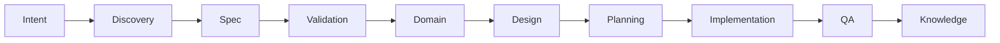

# Agentic Specification-Driven Development (ASDD) Framework

## Overview

**Agentic Specification-Driven Development (ASDD)** is a framework for building software using **AI-assisted specifications, autonomous agents, and production learning loops**. It transforms the traditional development lifecycle into a structured pipeline where specifications are the central artifact coordinating both humans and AI agents.

ASDD enables engineering teams to achieve dramatically higher output while maintaining architectural quality, security, and system observability by moving from human-centric agile processes to AI-native engineering.

## Core Principles

1.  **Ambiguity Is a Bug**: Machine-interpretable specifications validated by automated gates before any agent consumes them.
2.  **Specifications Are Executable**: Specs generate tests, architecture, validation rules, and API contracts.
3.  **AI Is a Pilot, Not a Passenger**: AI agents actively participate in development while humans retain formal authority and governance.
4.  **Contracts Over Code**: Each phase produces formal contracts (requirements, domain models, architecture).
5.  **Agents Fail — Design for Recovery**: Confidence thresholds, rollback procedures, and escalation paths are mandatory.
6.  **Humans Retain Override Authority**: Any team member may formally reject an agent artifact via the Dissent Protocol.

## The ASDD Pipeline

The framework orchestrates a multi-stage automated pipeline:

Each transition is governed by **Cumulative Confidence Scores (CCS)**. If confidence falls below established thresholds (e.g., CCS < 0.65), the pipeline halts for human intervention.

## Project Structure

This repository contains the core components and documentation for the ASDD framework:

-   **`claude-plugins/ffactory-asdd/`**: Specialized AI agents and skills for Claude.
    -   `agents/`: 10 specialized agents (Discovery, Spec, Validation, Design, Implementation, etc.).
    -   `skills/`: Reusable skills like Anti-pattern Detection, BMC Analysis, and User Story Decomposition.
-   **`kiro-powers/ffactory-asdd/`**: Configuration and steering for the Kiro IDE.
    -   `POWER.md`: Main entry point for the Kiro Power.
    -   `steering/`: Quality gates, agent references, and setup guides.
-   **`docs/`**: Comprehensive documentation of the framework.
    -   `index.md`: The full ASDD v5.0 Specification.
    -   `ASDD-Architecture-Pack.md`: Architectural guidelines.
    -   `raw-agents/`: Technical definitions of the agent roles.

## Getting Started

To understand the framework in depth, start with the **[Full ASDD Specification](docs/index.md)**.

## Governance & Quality

ASDD enforces quality through:
-   **Cumulative Confidence Score (CCS)**: Ensures high-fidelity transitions between stages.
-   **Dissent Protocol**: Formal mechanism for humans to override AI decisions.
-   **Production Learning Loop**: Capturing lessons learned to improve agent prompts and steering rules.

---
*Author: Edwin Encinas*  
*Year: 2026*
