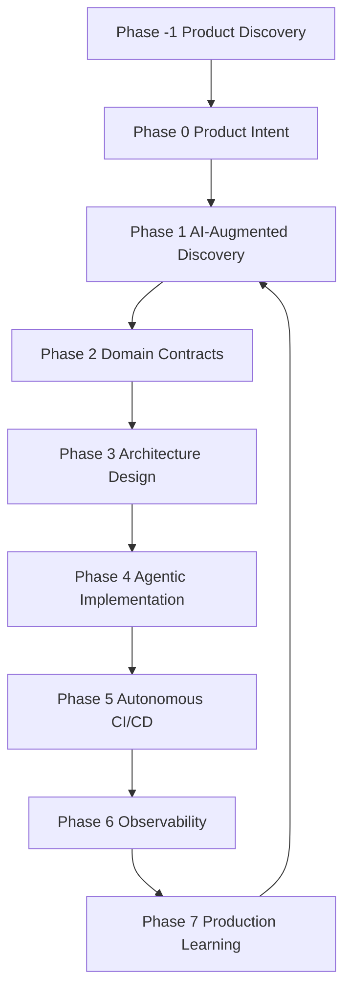

# 3. ASDD Lifecycle

This diagram represents the **complete lifecycle of the ASDD framework**.

# Run Agents 
**Product Owner**
    ↓
Product Intent Modeling (Jira rovo)
     ↓
**Tech Lead**
Discovery Agent
     ↓
Spec Agent
     ↓
Validation Agent
     ↓
Design Agent
     ↓
Domain Agent
     ↓
**Team members**
     ↓
Task planing
     ↓
Implementation Agent
     ↓
QA Agent
     ↓
Knowledge Agent
     ↓
Refactor Agent
     ↓
**DevOps**
     ↓
Security Agent
     ↓
Observability Agent