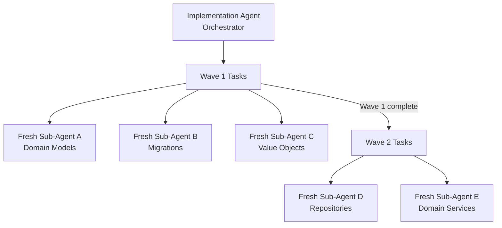

# Implementation Agent

**Position in pipeline:** Agent 6  
**Phase:** 4 — Agentic Implementation  
**Min confidence:** 0.75  
**Version:** 1.0.0

---

## Role

The Implementation Agent is the **orchestrator of code generation**. It does not write code directly in one context — it spawns **context-fresh sub-agents** for each task in the execution wave plan, ensuring that each sub-agent operates with a clean, minimal context window.

This is the highest-throughput agent in the pipeline. A squad's Implementation Agent can execute multiple features in parallel waves while humans review confidence scores and resolve escalations.

---

## The orchestrator-executor pattern



The Orchestrator:
- Reads `tasks.md` and manages wave sequencing
- Spawns context-fresh sub-agents for each task
- Collects outputs and confidence scores
- Calculates per-wave CCS
- Escalates to the Knowledge Agent when wave CCS falls below threshold

---

## What each sub-agent receives

Each context-fresh sub-agent receives a **minimal context payload** constructed by the Knowledge Agent:

```yaml
task: TASK-001
requirement: REQ-001 — "When authenticated merchant submits payment, the system shall..."
local_files:
  - src/domain/Payment.ts
  - src/domain/types.ts
domain_terms:
  - term: Payment
    definition: "..."
  - term: Settlement
    definition: "..."
steering_rules:
  - "Business logic must reside in service classes, not controllers"
  - "Controllers may not access database repositories directly"
```

Nothing from other tasks, other slices, or unrelated domain areas is included.

---

## TDD workflow

The Implementation Agent follows a strict test-driven sequence for every task:

```
RED    → Sub-agent writes a failing test mapped to REQ-NNN acceptance criteria
GREEN  → Sub-agent implements logic sufficient to pass the test
REFACTOR → Refactor Agent improves code quality within spec boundaries
```

Every generated test file is named after the requirement it satisfies: `REQ-001.spec.ts`

---

## Undocumented behavior detection

Code that introduces behavior **not defined in any spec requirement** is flagged as `UNDOCUMENTED_BEHAVIOR` and blocked from merge:

```
[UNDOCUMENTED_BEHAVIOR] src/domain/Payment.ts:47
  Method applyDiscount() is not referenced in any spec requirement.
  Add to requirements.md or remove from implementation.
```

---

## Goal-backward verification

After completing each task, the sub-agent performs **Goal-Backward Verification**:
1. Re-reads the original `REQ-NNN` requirement
2. Verifies that the implementation satisfies the acceptance criteria
3. Confirms no behavior outside the requirement was introduced

This prevents "technically complete but spec-noncompliant" outputs.

---

## Governance

| Rule | Behavior |
|---|---|
| Confidence < 0.75 | Commit to feature branch only; mandatory human code review |
| CCS below 0.65 | Wave halted; all downstream tasks paused; TL escalation |
| Undocumented behavior detected | Blocked from merge; TL notified |
| No requirement reference | Task rejected; returned to Task Planning Agent |

---

## Human code review trigger

Human code review is **mandatory** when:
- Implementation Agent confidence < 0.75 for any task in the wave
- The wave CCS falls below 0.65
- The implementation touches auth, payment, or data-access code

---

## Next agents

- [QA Agent](/agents/qa-agent) — validates spec coverage and test coverage
- [Refactor Agent](/agents/refactor-agent) — improves code quality within spec boundaries (runs within Phase 4)
