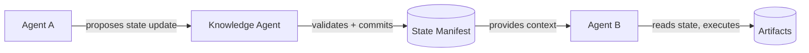

# Agent Catalog

ASDD defines **10 core specialized agents** plus supporting agents for security, observability, and DevOps. Each agent has a precisely defined role, a minimum confidence threshold, and a failure protocol.

---

## Core principle: separation of concerns

Each agent operates within a single, well-defined scope. No agent performs another agent's role. This separation is what makes the pipeline predictable, auditable, and recoverable when an agent fails.

---

## The 10 core agents at a glance

| Agent | Phase | Core Output | Min Confidence | Failure Action |
|---|---|---|---|---|
| [Discovery Agent](/agents/discovery-agent) | −1 / 0 | Behavioral slices from raw intent | 0.85 | Draft mode; route to PO/TL |
| [Spec Agent](/agents/spec-agent) | 1 | EARS-format requirements | 0.85 | Flag ambiguous sections; route to TL |
| [Validation Agent](/agents/validation-agent) | 1 | Spec quality score + validation report | 0.90 | Block pipeline; TL sign-off |
| [Domain Agent](/agents/domain-agent) | 2 | Schema-compliant domain model | 0.85 | Draft mode; TL review |
| [Design Agent](/agents/design-agent) | 3 | Architecture + ADRs + Reasoning Trace | 0.80 | Draft architecture; TL review before proceeding |
| [Task Planning Agent](/agents/task-planning-agent) | 4 | Execution wave plan (`tasks.md`) | 0.80 | Draft plan; TL review |
| [Implementation Agent](/agents/implementation-agent) | 4 | Code via context-fresh sub-agents | 0.75 | Feature branch; human code review |
| [QA Agent](/agents/qa-agent) | 1 + 5 | Test suites mapped to spec behaviors | 0.85 | Flag uncovered requirements |
| [Refactor Agent](/agents/refactor-agent) | 4 | Refactored code within spec boundaries | 0.80 | Flag; TL review |
| [Knowledge Agent](/agents/knowledge-agent) | All | State manifest, learning proposals | 0.80 | Propose update; human approval |

---

## Supporting agents

| Agent | Role | Min Confidence |
|---|---|---|
| Security Agent | Pre-deployment compliance scan | 0.95 |
| Observability Agent | Telemetry instrumentation and validation | 0.85 |
| DevOps Agent | CI/CD pipeline automation | 0.85 |

---

## Agent interaction pattern

Agents interact through the State Manifest, not directly with each other:

This indirect interaction pattern:
- Prevents agents from directly overriding each other's outputs
- Creates an immutable audit trail of every state transition
- Allows the Knowledge Agent to detect conflicts before they cause cascading failures

---

## Context injection: what agents receive

The Knowledge Agent is responsible for **Dynamic Context Injection** — ensuring each agent receives only the context relevant to its current task.

At each phase gate, the Knowledge Agent constructs a minimal context payload containing:

1. The active slice's `phase_data` (links to intent, requirements, design artifacts)
2. The applicable Ubiquitous Language terms for the current domain area
3. The Steering Rules relevant to the current phase
4. Prior Reasoning Traces from upstream agents in the same slice
5. Any open dissent notices or blockers for the slice

Everything else is withheld. A clean context window is as important as clean code.

---

## Reasoning traces

Every agent emits a `reasoning_trace.md` alongside its artifact. The trace documents:
- Key assumptions made
- Requirements prioritized and why
- Alternatives considered and rejected
- Uncertainty factors (required when confidence < 0.95)

Phase gate sign-off requires the TL to acknowledge the Reasoning Trace — not just the artifact.

---

## Navigate the catalog

Each agent has a dedicated page with full specification:

- [Discovery Agent](/agents/discovery-agent) — behavioral slicing and assumptions-first discovery
- [Spec Agent](/agents/spec-agent) — EARS requirements generation
- [Validation Agent](/agents/validation-agent) — ambiguity detection and quality scoring
- [Domain Agent](/agents/domain-agent) — domain model building and maintenance
- [Design Agent](/agents/design-agent) — architecture synthesis and ADRs
- [Task Planning Agent](/agents/task-planning-agent) — execution wave decomposition
- [Implementation Agent](/agents/implementation-agent) — code generation orchestration
- [QA Agent](/agents/qa-agent) — spec coverage validation and test generation
- [Refactor Agent](/agents/refactor-agent) — code quality maintenance
- [Knowledge Agent](/agents/knowledge-agent) — system memory, state, and learning
