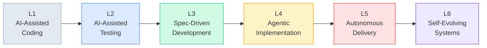

# ASDD Maturity Model

Organizations adopt ASDD progressively. Attempting to skip levels consistently produces governance failures — the safety infrastructure must precede the autonomy it governs.

The six levels span from basic AI code assistance (where most teams are today) to fully autonomous self-evolving systems (where ASDD v5.0 takes you).

---

## Overview

---

## Level 1 — AI-Assisted Coding

**Description:** AI code completion tools are in use. Developers prompt AI to generate functions, write boilerplate, or explain existing code.

**Characteristics:**
- No formal specification process
- AI output is accepted or rejected informally
- No audit trail of AI decisions
- No confidence scoring or governance

**This is where most teams are today.** The productivity gains are real but unpredictable — output quality depends on prompt quality, which varies by individual.

**Advancement criteria before moving to L2:**
- Establish a baseline spec format (any structured format)
- Introduce a QA Agent for automated test generation
- Define and track a "spec coverage" metric

---

## Level 2 — AI-Assisted Testing

**Description:** The QA Agent generates tests automatically. Spec coverage metrics are tracked. Human engineers review AI-generated tests.

**New capabilities:**
- QA Agent generating test suites from behavioral specs
- Spec coverage metric established and tracked
- Engineers reviewing agent-generated tests before merge

**Key shift:** Testing is no longer primarily a human-authored activity. Engineers transition from *writing* tests to *reviewing and validating* agent-generated tests.

**Advancement criteria before moving to L3:**
- Spec Validation Gate implemented and active
- Domain Model schema in use by at least one squad
- Sprint cadence defined with spec-readiness as a gate

---

## Level 3 — Specification-Driven Development

**Description:** All new work begins with an approved specification. The Spec Validation Gate is active. The Domain Model is the vocabulary contract for the system.

**New capabilities:**
- Spec Validation Gate: no work enters a sprint without a validated spec
- Domain Model in YAML schema format, enforced by CI
- EARS-format requirements for all new features
- Sprint cadence includes spec readiness review

**Key shift:** The Product Owner's role changes. POs author capability specs, not user stories. Spec approval is a formal gate, not an informal discussion.

**This is the most culturally challenging transition.** Teams resist because writing specs feels slower than starting implementation. Track Spec-to-Ship Time after 2 sprints — the reduction in rework typically demonstrates the efficiency gain.

**Advancement criteria before moving to L4:**
- Agent Failure Protocol active and documented
- Dissent Protocol in use (at least one logged dissent notice per sprint)
- Security Enforcement Layer live in CI

---

## Level 4 — Agentic Implementation

**Description:** The Implementation Agent generates code for new features. Engineers review all agent output. The Agent Failure Protocol is active — pipeline halts are handled, not ignored.

**New capabilities:**
- Implementation Agent generating code in execution waves
- Context-fresh sub-agents for each implementation task
- Agent Failure Protocol: confidence thresholds, cascade guardrails, rollback procedures
- Dissent Protocol in active use
- Security Enforcement Layer enforced in CI

**Key shift:** Engineers move from primary code authors to agent orchestrators. This requires new skills: spec writing, agent configuration, and understanding confidence scoring — not just coding.

**Agent confidence thresholds at this level:**

| Agent | Minimum Confidence | Action if Below |
|---|---|---|
| Spec Agent | 0.85 | Flag, route to human |
| Validation Agent | 0.90 | Block pipeline, TL sign-off |
| Design Agent | 0.80 | Draft mode, TL review required |
| Implementation Agent | 0.75 | Feature branch, human code review |
| Security Agent | 0.95 | Block deployment |

**Advancement criteria before moving to L5:**
- Knowledge Agent in operation (observation-only mode is acceptable)
- Self-Healing PRs implemented with all safety gates from Phase 7
- Second-order metrics tracked (hallucination rate, override frequency, etc.)

---

## Level 5 — Autonomous Delivery

**Description:** The full ASDD pipeline is operational. The Knowledge Agent is accumulating learning and proposing steering rule updates. Self-Healing PRs are enabled with full safety gates.

**New capabilities:**
- Knowledge Agent active: accumulating failure patterns, proposing steering updates
- Self-Healing PRs: agent-initiated code changes with mandatory human review
- Full production learning loop: telemetry → Knowledge Agent → steering proposals → human approval
- Second-order metrics tracked and reviewed

**Self-Healing PR safety gates (mandatory at this level):**
- Maximum 3 files per PR
- No authentication, authorization, payment, or data-access code without explicit TL approval
- No code deletion — only add or modify
- Mandatory TL + Engineer review
- CI must pass fully — no force-bypass
- Documented rollback procedure in every PR

**Key shift:** The system now has a feedback loop from production to specifications. This is qualitatively different from L4 — the pipeline is no longer just executing; it is learning.

**Advancement criteria before moving to L6:**
- Override frequency < 1 per agent per sprint (agents are reliable enough to require rare human intervention)
- Revert rate on Self-Healing PRs < 10%
- Full production learning loop active and producing value

---

## Level 6 — Self-Evolving Systems

**Description:** The system continuously improves itself within formally defined safety boundaries. The Knowledge Agent's proposals are accurate enough that override frequency is minimal. Retro-specification of legacy code is underway.

**Characteristics:**
- Override frequency < 1 per agent per sprint
- Self-Healing PR revert rate < 10%
- Full production learning loop: telemetry → pattern detection → proposal → human approval → code evolution
- Legacy code being retro-specified incrementally (highest-change areas first)
- Cross-squad dependency graph maintained by the Knowledge Agent

**This is the target state of ASDD v5.0.** At L6, small squads of 3 humans + AI agents are maintaining and evolving complex systems that would traditionally require teams of 10–20 engineers.

---

## Advancement summary

| Level | Description | Gate to Advance |
|---|---|---|
| L1 | AI-assisted coding | Spec format + QA Agent + coverage metric |
| L2 | AI-assisted testing | Validation Gate + Domain Model + sprint cadence |
| L3 | Spec-driven development | Agent Failure Protocol + Dissent Protocol + Security Layer |
| L4 | Agentic implementation | Knowledge Agent + Self-Healing PRs + second-order metrics |
| L5 | Autonomous delivery | Override < 1/sprint/agent + revert rate < 10% + full learning loop |
| L6 | Self-evolving systems | (Terminal level — continuous improvement within safety boundaries) |

---

## Common failure modes by level

| Level transition | Common failure | Prevention |
|---|---|---|
| L1 → L2 | Skipping spec format, going straight to test generation | Enforce spec format as a prerequisite to QA Agent access |
| L2 → L3 | Domain Model inconsistency — agents use different vocabulary | Domain Model schema enforced in CI from day one of L2 |
| L3 → L4 | Engineers bypassing dissent protocol informally | Dissent Protocol SLA enforcement by TL; track override frequency |
| L4 → L5 | Knowledge Agent proposals auto-approved without review | Hard gate: proposals require TL + Engineer sign-off before merge |
| L5 → L6 | Self-Healing PR revert rate too high | Root cause analysis per revert; Knowledge Agent's learning pattern validated against 3+ incidents before proposal |

---

## Next

- [Change Management](/playbook/change-management) — role transition guidance and resistance patterns for your team
- [Technical Reference](/technical-reference/architecture) — the architecture underpinning each maturity level
