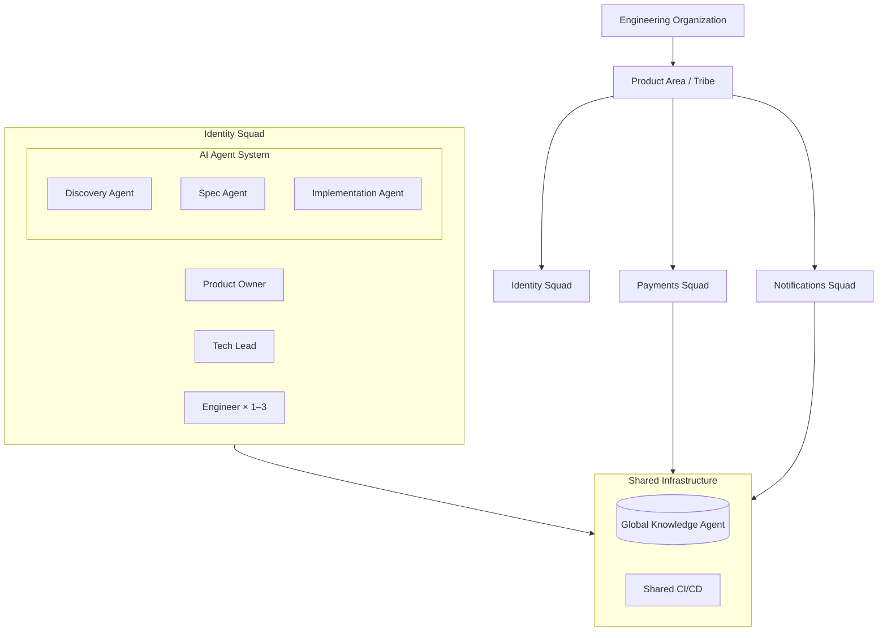

# Team & Squad Model

ASDD adopts the **squad-based structure** pioneered by Spotify engineering. Each squad owns a business capability end-to-end and operates autonomously within shared architectural governance. The key evolution: **AI agents are first-class squad members**, not tools.

---

## Organizational hierarchy

### Tribe (Product Area)
A **Tribe** groups squads working within a related domain. Tribes share architectural standards, tooling, and a global Knowledge Agent that accumulates learning across squads.

### Squads
Each squad owns a specific business capability from product intent to production operation. Squads are autonomous — they do not hand off work to other teams for implementation or QA.

---

## Squad composition

| Role | Headcount | FTE | Primary Accountability |
|---|---|---|---|
| Product Owner | 1 shared across 2–3 squads | 0.5 | Business intent, spec approval, outcome acceptance |
| Tech Lead | 1 | 1.0 | Technical integrity, ASDD lifecycle enforcement, agent governance |
| Engineers | 1–3 | 1.0 each | Spec fidelity, agent output review, dissent notices |
| AI Agent System | 6–10 agents | — | Discovery, spec validation, design, implementation, QA, security, CI/CD |

A squad of **3 humans + 8 AI agents** has the implementation throughput of a much larger traditional team, while retaining formal human authority over every architectural and business decision.

---

## Role definitions

### Product Owner

**Accountability:** *Meaning and Business Value*

The PO in ASDD is responsible for clarity of intent, not granularity of tasks. The shift from traditional product management is significant:

**The PO does:**
- Owns **Capability Specs** — structured descriptions of what the system should do, not how
- Defines business rules, constraints, and measurable success criteria
- Prioritizes the spec backlog and determines slice sequencing
- Validates and approves `intent.md` before Phase 1 begins
- Accepts sprint outcomes based on spec compliance, not demo performance
- Exercises formal override authority when agent outputs conflict with business intent

**The PO no longer does:**
- Write detailed user stories mid-sprint
- Clarify requirements during implementation
- Negotiate scope after sprint start

> One PO may serve 2–3 squads, depending on domain complexity. The time savings come from the elimination of mid-sprint clarification — specs must be approved before sprint start.

---

### Tech Lead

**Accountability:** *Flow, Quality, and Technical Integrity*

The Tech Lead is the most critical role in the ASDD framework. All agent escalations route to the TL. All phase gates require TL sign-off.

**Responsibilities:**
- Enforces the ASDD lifecycle and phase gate discipline
- Facilitates sprint ceremonies and spec readiness reviews
- Ensures all specs pass the Validation Gate before sprint start
- Owns technical coherence: architecture, domain model, and steering rules
- Resolves all agent escalations requiring human judgment
- Maintains the Agent Failure Log (see [Governance](/technical-reference/governance))
- Reviews and acknowledges Reasoning Traces at each phase gate
- Coaches the squad in ASDD practices

**Override authority:** Full, at every phase. The TL's decision on agent escalations is final within the squad.

---

### Engineers

**Accountability:** *Execution and Spec Fidelity*

Engineers in ASDD are **agent orchestrators and quality reviewers**, not primary code authors. The work shifts from writing to directing and validating.

**Responsibilities:**
- Implement exactly what is defined in the spec — no undocumented behavior
- Identify spec gaps **before sprint start** (not during implementation)
- Write tests mapped to spec behaviors
- Emit events, logs, and metrics as defined in the spec
- Reject undocumented behavior — if it isn't in the spec, it doesn't ship
- File formal Dissent Notices when agent output is technically unsafe or spec-noncompliant

**Engineer core principles:**
1. **Specs before sprints** — No work enters a sprint without an approved spec
2. **Single source of truth** — The spec replaces scattered user stories and acceptance criteria
3. **Autonomous squads** — Own the capability end-to-end; no cross-team handoffs
4. **Role clarity** — Clear accountability eliminates ambiguous handoffs
5. **Flow efficiency** — Optimize for fast, stable delivery over resource utilization

:::note For junior engineers
Your primary learning path in ASDD is through spec-fidelity review — understanding why an agent's output does or does not match the spec teaches both domain modeling and system design faster than writing implementation code directly.
:::

---

### The AI Agent System

The AI Agent System is not a single tool — it is a coordinated pipeline of 10 specialized agents, each with a defined role and confidence threshold. See the [Agent Catalog](/agents/overview) for full specifications.

At the squad level, the agent system functions as a highly capable, always-available execution partner that:
- Works in parallel across multiple slices simultaneously
- Never blocks on human coordination (within its authority boundaries)
- Reports confidence scores, not just outputs
- Escalates automatically when confidence falls below threshold

---

## Decision rights

Clear decision ownership is what makes autonomous squads safe. The following matrix defines who decides what:

| Decision | Owner |
|---|---|
| Business priority and spec sequencing | Product Owner |
| Spec approval (Phase 0 → 1) | PO + TL |
| Technical approach and architecture | Tech Lead |
| Implementation details within spec | Engineers |
| Agent output rejection (Dissent Notice) | Any team member |
| Agent escalation resolution | Tech Lead |
| Self-Healing PR approval | TL + at least one Engineer |
| Security gate bypass (emergency only) | TL (logged immutably) |

:::warning
Any decision not on this table defaults to the Tech Lead. Ambiguous decision ownership is the most common cause of governance gaps.
:::

---

## The Knowledge Agent: shared intelligence

One Knowledge Agent operates at the **Tribe level**, accumulating learning across all squads. This is the system memory:

- Maintains the State Manifest for each squad's slices
- Detects conflicts when two squads modify the same shared domain entity
- Proposes steering rule updates based on cross-squad failure patterns
- Ensures context-fresh sub-agents receive only relevant domain terms

A single Knowledge Agent across 3–5 squads builds institutional knowledge faster than any human retrospective process.

---

## Next

- [Maturity Model](/for-leaders/maturity-model) — the L1–L6 progression for phased ASDD adoption
- [Change Management](/playbook/change-management) — role transition guidance and resistance patterns
- [Governance](/technical-reference/governance) — the technical details of confidence scoring and dissent protocols
