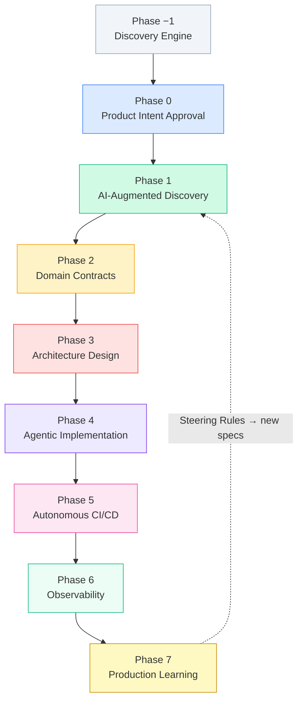

# The ASDD Lifecycle

ASDD defines an **eight-phase lifecycle** that transforms business intent into a deployed, observable, continuously-learning system. Each phase has a defined owner, formal artifacts, and an exit gate that must pass before the next phase begins.



---

## Phase −1 — Discovery Engine

**Purpose:** Align stakeholders and establish the domain foundation before any AI-augmented work begins.

**Owner:** PO + TL jointly

**Activities:**
- **Lean Inception** (Paulo Caroli) — 1-week structured workshop to align on vision, personas, features, and MVP
- **DDD Workshop** — Identification of Ubiquitous Language, Bounded Contexts, and core Domain Events

**Artifacts produced:**

| Artifact | Description |
|---|---|
| `mvp-canvas.md` | Feature scope, MVP definition, slice assignments |
| `personas.md` | Actor definitions used by all downstream agents |
| `user-journeys.md` | Step-by-step user flows |
| `features.md` | Prioritized feature list |
| `context-map.md` | Bounded context diagram |
| `domain-model.md` (seed) | Core entities, ubiquitous language, invariants |

**Exit gate:** All core discovery artifacts exist and are consistent with the proposed mission.

See [Discovery Engine](/playbook/discovery-engine) for the complete facilitation guide.

---

## Phase 0 — Product Intent Approval

**Purpose:** Formalize the strategic purpose and obtain PO sign-off before any agent work begins.

**Owner:** Product Owner

**Artifact:** `intent.md`

**Required sections:**
- Mission (Elevator Pitch from Lean Inception)
- Capabilities (what the system can do — behavioral, not technical)
- Success Metrics (measurable business outcomes)
- Non-Goals (explicit scope exclusions)
- Bounded Context (which domain area this covers)
- Domain Entities Involved (names from `domain-model.md`)

**Exit gate:** PO approves `intent.md` with confidence score ≥ 0.85. No Phase 1 work begins without an approved intent document.

:::danger Non-negotiable
If `intent.md` is not approved, the pipeline does not start. There are no exceptions. A "mostly done" or "we'll figure it out" intent document will produce hallucinated specs downstream.
:::

---

## Phase 1 — AI-Augmented Discovery (Behavioral Slicing)

**Purpose:** Transform approved intent into formal, machine-interpretable requirements.

**Owner:** Tech Lead (gate approval)

**Agents:** Discovery Agent, Spec Agent, Validation Agent, QA Agent (Mode C)

**Artifact:** `requirements.md`

Every requirement must be:
- **Categorized:** `[FEATURE | BUG | IMPROVEMENT | MODULE | PRODUCT]`
- **Sliced:** Assigned to MVP, V1, V2, etc.
- **Risk-assessed:** `[LOW | HIGH]` risk by the Validation Agent
- **Atomic:** One requirement describes exactly one behavior
- **Testable:** Validated by the QA Agent
- **Written in EARS format**

### The Spec Validation Gate (JIT)

The Spec Validation Gate is **Just-in-Time** — requirements move through the pipeline in slices, not wholesale. Three governance modes are supported:

1. **Delegated Authority (Auto-Approval):** For LOW RISK `BUG` or `IMPROVEMENT` categories with Validation Agent confidence ≥ 0.95, the requirement is auto-approved.
2. **Asynchronous Approval (RFC Mode):** TL and PO review RFC-style proposals. No dissent within the SLA window = implicit approval.
3. **AI-Assisted Peer Review:** QA Agent peer-reviews Spec Agent output before reaching the human TL, filtering noise.

### Gate checks

| Check | Automated | Owner if failed |
|---|---|---|
| Correct category assigned | Yes | Spec Agent |
| Slice assignment present | Yes | Spec Agent |
| EARS syntax compliance | Yes (linter) | Spec Agent |
| All domain terms in `domain-model.md` | Yes | Validation Agent → TL |
| Testability score ≥ 0.80 | Yes | Validation Agent → TL |
| Risk score assigned | Yes | Validation Agent |

**Gate failure behavior:** The failing requirement is marked `BLOCKED — VALIDATION FAILED`. Other requirements in the same Slice may proceed. The Slice status remains `PARTIAL` until all MUST requirements pass.

**Exit gate:** All requirements in the active slice pass the Spec Validation Gate. TL signs off.

---

## Phase 2 — Domain Contracts

**Purpose:** Build and maintain the shared domain language that all agents and humans use.

**Owner:** Tech Lead

**Agent:** Domain Agent

**Artifact:** `domain-model.md` (schema-compliant YAML)

The Domain Model is **not a free-form document**. It conforms to a strict schema consumed by downstream agents:

```yaml
domain: <domain name>
version: <semver>
last_updated: <ISO date>
owner: <Tech Lead name>

entities:
  - name: <EntityName>
    description: <one sentence>
    attributes:
      - name: <attribute>
        type: <primitive or reference>
        required: true | false
    invariants:
      - <business rule that must always hold>

aggregates:
  - root: <EntityName>
    members: [<EntityName>, ...]

domain_events:
  - name: <EventName>
    trigger: <what causes this event>
    payload: [<attribute>, ...]

ubiquitous_language:
  - term: <Term>
    definition: <definition>
    aliases: [<alias>, ...]
```

**Exit gate:** TL approves schema-compliant `domain-model.md`. Non-compliant files are rejected by the CI gate.

---

## Phase 3 — Architecture Design

**Purpose:** Synthesize architecture from the approved domain contracts and requirements.

**Owner:** Tech Lead

**Agent:** Design Agent

**Artifact:** `design.md`

**Required contents:**
- Architecture overview (component diagram)
- Component boundaries and responsibilities
- Database schema (ERD or equivalent)
- Sequence diagrams for critical flows
- Non-functional requirements addressed
- Security surface analysis
- Architectural Decision Records (ADRs) for all significant choices

Architecture rules are enforced via `.asdd/steering/architecture-rules.md` in CI.

**Exit gate:** TL reviews and approves `design.md` + Reasoning Trace. Architecture must be traceable to at least one requirement in `requirements.md`.

---

## Phase 4 — Agentic Implementation (Waves & Sub-Agents)

**Purpose:** Generate code and tests from the approved architecture and requirements.

**Owner:** TL + Engineers

**Agents:** Task Planning Agent, Implementation Agent (Orchestrator), Context-Fresh Sub-Agents, Refactor Agent

**Artifact:** `tasks.md` (execution wave plan)

### Execution waves

Implementation is organized into parallel waves respecting architectural layer dependencies:

| Wave | Contents | Can run in parallel? |
|---|---|---|
| Wave 1: Foundation | Migrations, Domain Models, Value Objects, Shared Utils | Yes (within wave) |
| Wave 2: Persistence & Logic | Repositories, Domain Services | Yes (within wave) |
| Wave 3: Integration & API | Application Services, Controllers, API Handlers | Yes (within wave) |
| Wave 4: Polish | Observability, Documentation, Feature Flags | Yes (within wave) |

Each task is executed by a **context-fresh sub-agent** — spawned with only the specific task, its requirements, and the relevant local files. This prevents context rot (performance degradation in long context windows).

### TDD workflow

```
RED   → Implementation Agent writes failing tests mapped to spec behaviors
GREEN → Implementation Agent implements logic to pass tests
REFACTOR → Refactor Agent improves code quality within spec boundaries
```

Every implementation task must reference the spec requirement it satisfies. Code that introduces behavior not defined in any spec requirement is flagged as `UNDOCUMENTED_BEHAVIOR` and blocked from merge.

**Exit gate:** QA Agent confirms test coverage ≥ threshold (defined in `.asdd/steering/quality-gates.md`). Security Agent runs compliance scan. Human code review required when Implementation Agent confidence < 0.75.

---

## Phase 5 — Autonomous CI/CD

**Purpose:** Validate the system through automated pipelines before deployment.

**Owner:** DevOps Agent + Tech Lead

**Agents:** QA Agent (Mode B), Security Agent, DevOps Agent

CI pipelines automatically validate:
- Specification coverage — every requirement has at least one test
- Test coverage — configurable minimum, default 80%
- Security compliance — policy gates from `.asdd/steering/security-rules.md`
- Agent confidence scores — logged and reviewed

**Human gate:** Any pipeline failure requires Tech Lead acknowledgment before the pipeline can be force-bypassed. Force-bypasses are logged immutably.

**Exit gate:** All pipeline gates green; no force-bypass; Security Agent confidence ≥ 0.95.

---

## Phase 6 — Observability

**Purpose:** Ensure the system is measurable and errors are detectable in real-time.

**Owner:** Tech Lead

**Agent:** Observability Agent

**Artifacts:** `telemetry-plan.md`, `dashboards.json`, `alerts.yaml`

**Required telemetry per service:**
- API latency (p50, p95, p99)
- Error rate by type
- Transaction success/failure counts
- Business event counts (mapped to domain events from `domain-model.md`)

The Observability Agent instruments the system and validates that all defined telemetry points are emitting correctly before the phase gate closes.

**Exit gate:** Observability Agent confirms telemetry emission from all new components.

---

## Phase 7 — Production Learning Loop

**Purpose:** Enable the system to self-correct within formally defined safety boundaries.

**Owner:** TL + PO

**Agent:** Knowledge Agent, Observability Agent

### The learning loop process

1. **Detection:** Observability Agent identifies a bottleneck, recurring error, or anomalous pattern
2. **Analysis:** Knowledge Agent correlates the pattern against known failure modes and prior dissent log entries
3. **Proposal:** Knowledge Agent proposes a steering rule update in a `DRAFT` PR
4. **Human Approval Gate:** TL + at least one Engineer review and approve or reject
5. **Evolution:** On approval, `.asdd/steering/` is updated
6. **Self-Healing PR:** Agent-initiated code change to align existing code with the new rule

### Self-Healing PR safety gates

Self-Healing PRs carry elevated risk. The following constraints are mandatory:

| Constraint | Rule |
|---|---|
| File scope | Maximum 3 files per PR |
| Sensitive code | No auth, authorization, payment, or data-access code without explicit TL approval |
| Deletions | No code deletion — only add or modify |
| Review | Mandatory TL + Engineer review |
| CI | Must pass fully — no force-bypass |
| Rollback | Documented rollback procedure in every PR description |
| Audit | Tagged `self-healing`; listed in `/docs/self-healing-log.md` |

**Exit gate:** Knowledge Agent proposals reviewed by TL + PO; approved updates applied; no open Self-Healing PRs pending review.

---

## Quick reference: Phase gate checklist

| Phase | Exit Condition | Owner |
|---|---|---|
| −1 Discovery | All discovery artifacts exist; PRD approved | PO + TL |
| 0 Intent | `intent.md` approved; confidence ≥ 0.85 | PO |
| 1 Requirements | All slice requirements pass Spec Validation Gate | TL |
| 2 Domain | `domain-model.md` schema-compliant; TL-approved | TL |
| 3 Architecture | `design.md` traceable to requirements; TL-approved + Reasoning Trace | TL |
| 4 Implementation | Waves complete; TDD green; Reasoning Traces acknowledged | TL + Engineer |
| 5 CI/CD | All gates green; no force-bypass | DevOps Agent + TL |
| 6 Observability | Telemetry emitting; Observability Agent confirmed | TL |
| 7 Learning | Knowledge Agent proposals reviewed; approved updates applied | TL + PO |

---

## Next

- [Sprint Cadence](/playbook/sprint-cadence) — how the ASDD lifecycle maps to a 2-week sprint
- [Technical Reference: Agent Pipeline](/technical-reference/agent-pipeline) — the agent architecture in detail
