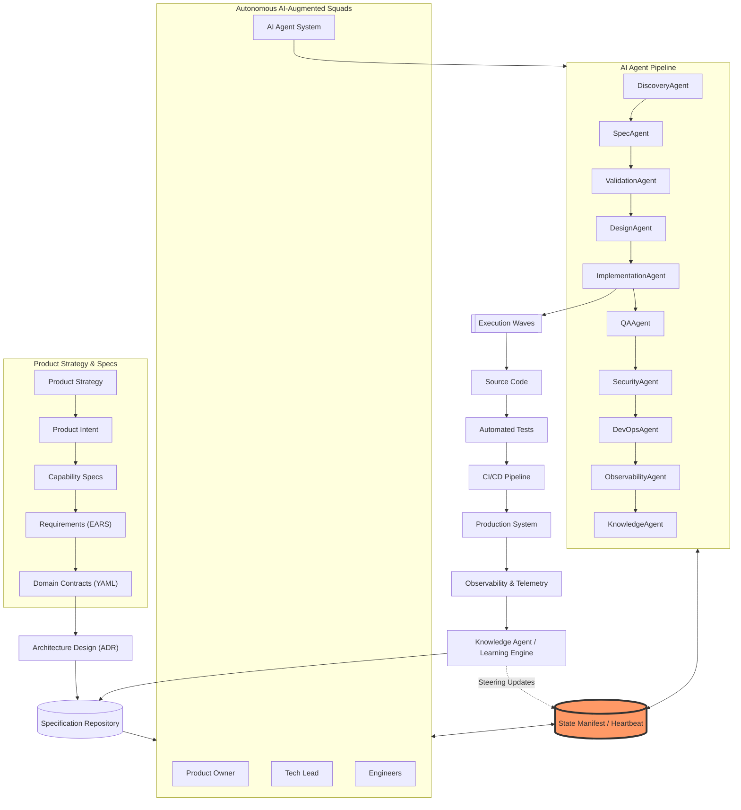
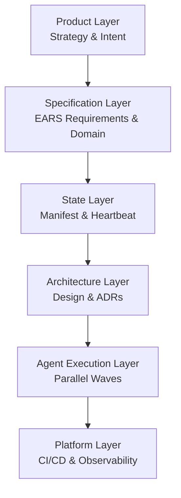
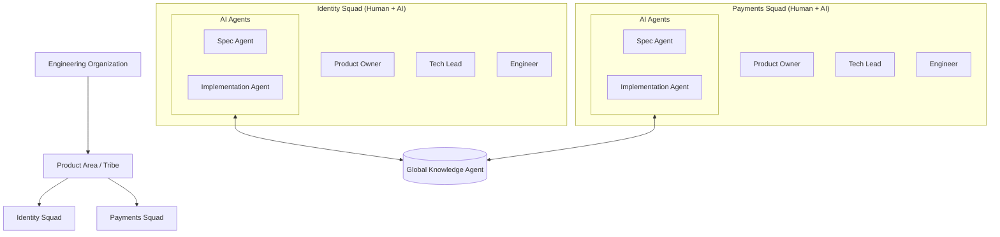
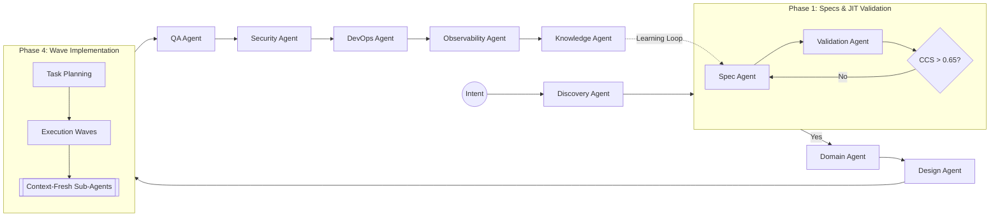
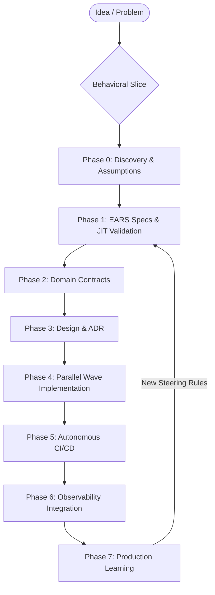
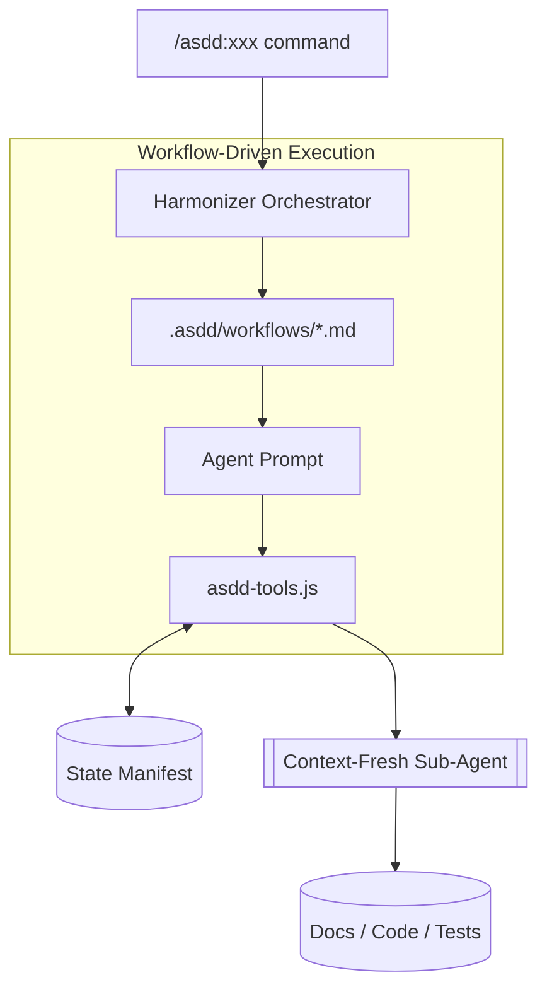
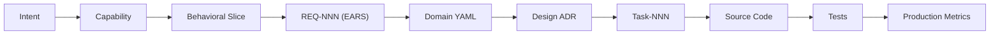
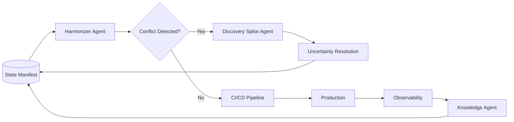
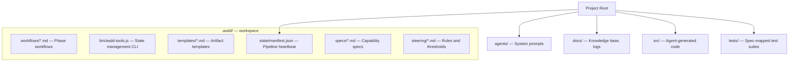
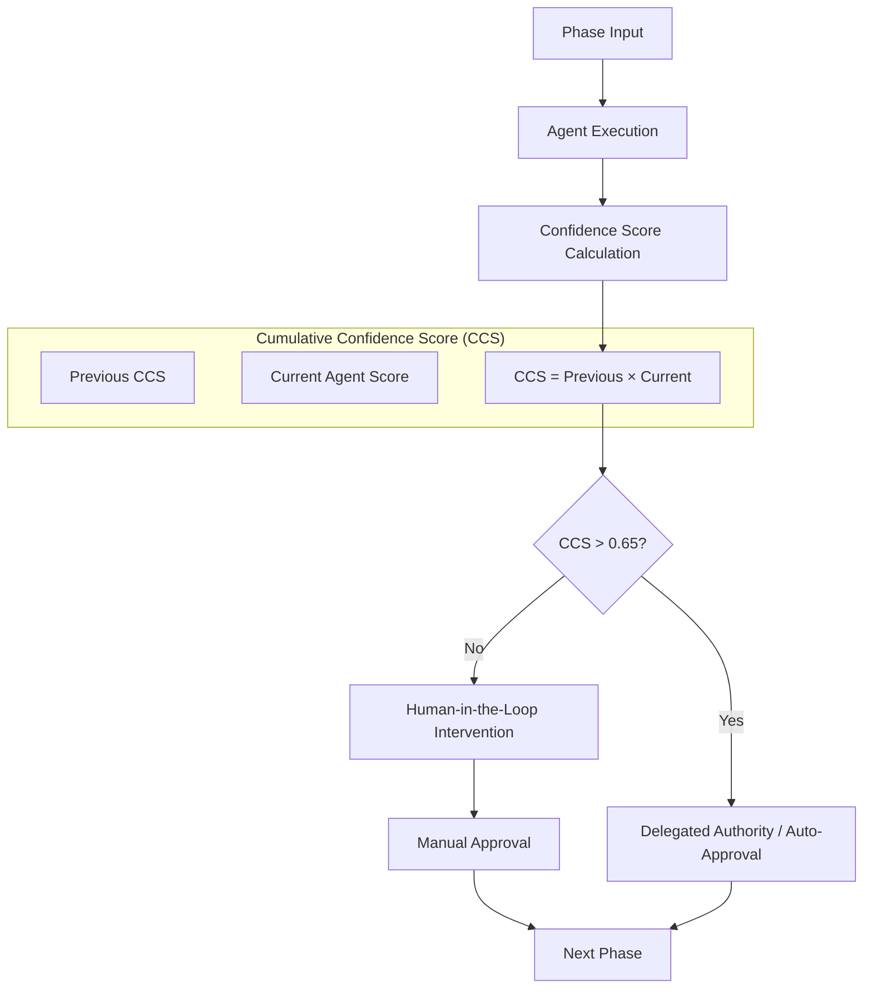

# ASDD System Architecture

> This section is the visual architecture reference for ASDD v5.0/6.0. All diagrams are rendered from Mermaid source.

---

## 1. The Big Picture: ASDD Master System

The complete operating model showing how product strategy, specifications, AI-augmented squads, and the State Manifest backbone interact.

---

## 2. Architectural Layers

The six layers that define the ASDD structural hierarchy.

| Layer | What it contains | Human or Agent owned? |
|---|---|---|
| **Product** | Strategy, product intent, MVP scope | Human (PO) |
| **Specification** | EARS requirements, domain contracts | Human-approved, Agent-assisted |
| **State** | `manifest.json` — pipeline heartbeat | Knowledge Agent (maintained) |
| **Architecture** | Design, ADRs, component maps | Agent-synthesized, Human-approved |
| **Agent Execution** | Code generation, testing, security scans | Agent (with human phase gates) |
| **Platform** | CI/CD pipelines, observability, telemetry | Agent-automated, Human-governed |

---

## 3. Organizational Architecture: Tribes and Squads

A single Global Knowledge Agent accumulates learning across all squads in the tribe — surfacing cross-squad patterns that individual squads cannot see.

---

## 4. AI Agent Orchestration Pipeline

The high-velocity pipeline showing CCS gates and parallel wave execution.

---

## 5. Lifecycle: Behavioral Slicing

The lifecycle is **slice-based**, not monolithic. Each slice (feature, bug, improvement) flows through the pipeline independently.

**Behavioral Slicing** means the team does not wait for all features to be specified before any implementation begins. Slices flow through the pipeline in parallel — a feature in Wave Implementation while a bug fix is in Spec Validation.

---

## 6. Runtime Architecture: Workflow-Driven Execution

Agents are not just prompts — they are **Workflow Executors** that interact with the system via deterministic tools.

Agents **must** call `asdd-tools.js` to update manifest state — they cannot edit `manifest.json` directly. This ensures every state transition is validated and logged.

---

## 7. Specification-to-Code Traceability

Full-spectrum traceability from product intent to individual lines of code and production metrics.

Every line of production code traces back to a specific requirement. Every requirement traces back to the approved intent. This traceability chain is what makes ASDD auditable.

---

## 8. Autonomous Delivery Loop: The Harmonizer

The Harmonizer maintains system health by detecting conflicts early. **Discovery Spike Agents** resolve uncertainty automatically when possible — only escalating to humans when no Steering Rule covers the conflict.

---

## 9. Repository Structure

See [Repository Structure](/technical-reference/repository-structure) for the complete directory reference.

---

## 10. AI Governance: The CCS Model

The **Product Law of Confidence** ensures AI autonomy is earned through verified quality.

| Metric | Rule |
|---|---|
| Individual threshold | Per-agent minimum (0.75–0.95 depending on agent) |
| CCS threshold | 0.65 — product of all agent scores in the pipeline path |
| Dynamic gating | If a preceding agent scores low (but above threshold), the next agent's minimum increases by +0.05 |
| Uncertainty factors | Required when score < 0.95 — agents must list what they are uncertain about |

---

## Architecture summary

| Diagram | Key concept |
|---|---|
| 1 — Master System | State Manifest Backbone as the coordination hub |
| 2 — Layers | Six-layer structural hierarchy |
| 3 — Organization | Tribes, squads, and Global Knowledge Agent |
| 4 — Agent Pipeline | CCS gates and parallel wave execution |
| 5 — Lifecycle | Behavioral Slicing and JIT Validation |
| 6 — Runtime | Workflow-driven orchestration via asdd-tools |
| 7 — Traceability | Intent → code → production metrics |
| 8 — Delivery Loop | Harmonizer and Discovery Spike Agents |
| 9 — Repository | `.asdd/` (workflows, tooling, state, specs, steering) |
| 10 — Governance | Product Law of Confidence (CCS > 0.65) |
