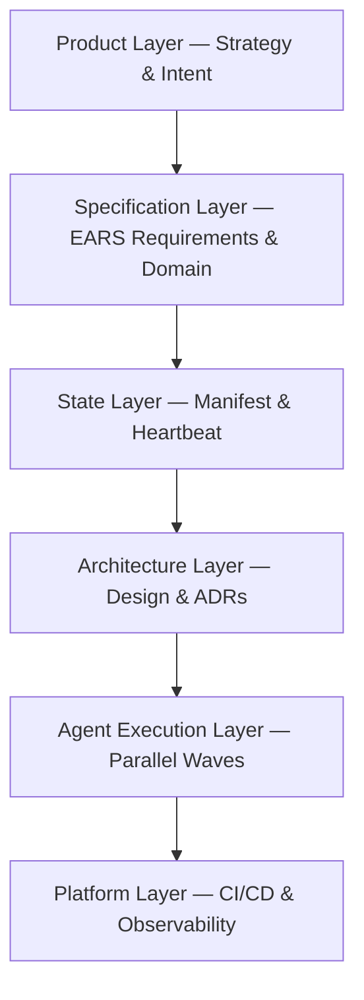

# What is ASDD?

**Agentic Specification-Driven Development (ASDD)** is a software engineering framework for teams that build with AI agents. It replaces informal AI-assisted workflows with a structured pipeline where **specifications are the central artifact** coordinating both humans and machines.

> Version 5.0 · Agentic Era 2026 · Author: Edwin Encinas

---

## The core problem ASDD solves

Most teams using AI in development have the same experience: the AI writes code quickly, but the code is wrong, inconsistent, or doesn't match the intended behavior. The root cause is almost never the AI — it's **vague intent**.

ASDD enforces that clarity happens *before* agents execute. A machine-interpretable specification, agreed upon by humans, enables agents to execute correctly at speed.

| Traditional AI-Augmented Dev | ASDD |
|---|---|
| Prompt → Code (hope for the best) | Intent → Spec → Validated spec → Agent execution |
| Hallucinations discovered in code review | Ambiguity eliminated at the spec gate |
| No audit trail of AI decisions | Every agent action is logged with a confidence score |
| AI replaces human judgment | AI proposes; humans govern; both learn |

---

## The five layers

ASDD is organized around five structural layers:

1. **Product Layer** — Where strategy, vision, and intent live. Owned by the Product Owner.
2. **Specification Layer** — Machine-interpretable requirements and domain contracts. The handoff point between humans and agents.
3. **State Layer** — The State Manifest: a centralized heartbeat tracking every slice's position in the pipeline.
4. **Architecture Layer** — Design decisions and Architectural Decision Records (ADRs) synthesized by the Design Agent.
5. **Agent Execution Layer** — 10 specialized agents executing in parallel waves.
6. **Platform Layer** — CI/CD automation, security gates, and observability.

---

## Key concepts at a glance

| Concept | What it means |
|---|---|
| **Behavioral Slice** | A self-contained unit of work (feature, bug, improvement) that flows through the pipeline independently |
| **EARS format** | A structured syntax for writing unambiguous, machine-interpretable requirements |
| **Phase Gate** | A validation checkpoint between lifecycle phases; requires human sign-off |
| **Confidence Score** | A 0.0–1.0 score emitted by every agent alongside every artifact |
| **CCS** | Cumulative Confidence Score — the product of all scores in a pipeline path; below 0.65 triggers a halt |
| **Dissent Notice** | A formal, structured mechanism for any team member to reject an agent artifact |
| **State Manifest** | `.kiro/state/manifest.json` — the single source of truth for pipeline state |
| **Knowledge Agent** | The system memory agent: maintains state, detects conflicts, and proposes improvements |
| **Self-Healing PR** | An agent-initiated pull request to align code with updated steering rules |

---

## Who is this documentation for?

This site is organized by role. Jump to the section most relevant to you:

### 🏢 CTOs, VPs, and Engineering Managers
Start with **[For Leaders](/for-leaders)** — executive overview, team model, ROI, and the maturity model for phased adoption.

### 🏗️ Tech Leads and Architects
Start with the **[Playbook](/playbook)** for adoption sequencing, then **[Technical Reference](/technical-reference/architecture)** for system architecture and governance.

### 💻 Engineers and Juniors
Start with **[Getting Started](/playbook)** to understand your role, then the **[Agent Catalog](/agents/overview)** to see what your AI teammates are doing.

---

## Next steps

- **Read the Manifesto** → [Human–Agent Agile Manifesto](/manifesto) — 14 principles for the agentic era
- **Understand the lifecycle** → [ASDD Lifecycle](/playbook/lifecycle) — 8 phases from discovery to production learning
- **See the full agent pipeline** → [Technical Reference](/technical-reference/agent-pipeline) — how 10 agents transform intent into code
