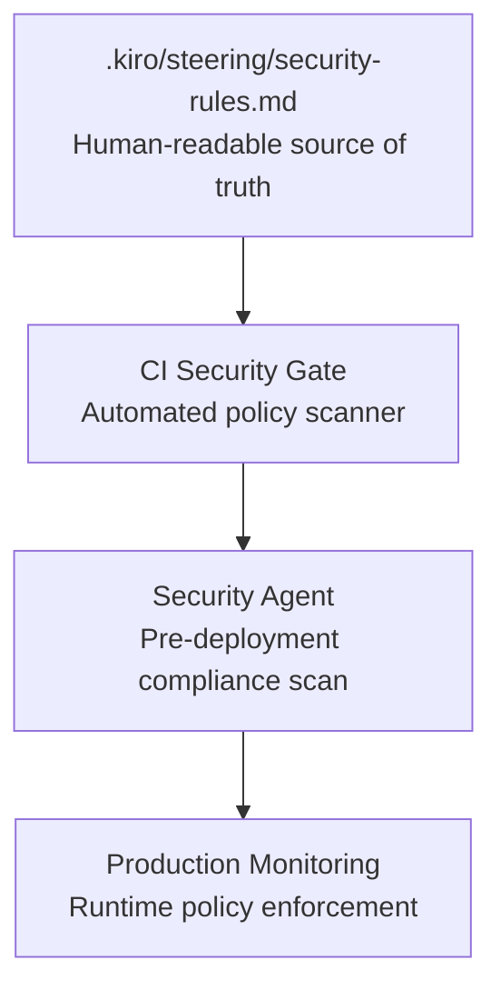

# Security Enforcement Layer

Security in ASDD is **not based on markdown rules alone**. Steering rules stored in `.kiro/steering/` are the *specification* — enforcement happens at multiple automated layers, validated by the Security Agent before every deployment.

---

## Enforcement architecture

Every rule defined in `.kiro/steering/security-rules.md` is enforced at three stages:
1. **CI gate** — structural and static analysis rules enforced on every PR
2. **Security Agent** — behavioral and deployment rules scanned pre-deployment
3. **Production monitoring** — runtime policy enforcement with alerting

A security issue that passes all three layers is a governance failure, not just a code defect.

---

## Rule categories

### Structural rules (CI enforcement, static analysis)

These rules govern code structure and are enforced automatically:

- Business logic must reside in service classes, not controllers
- Controllers may not access database repositories directly
- Authentication middleware must be present on all non-public routes
- Dependency injection patterns must be used for service instantiation

**Violation response:** CI gate fails; PR blocked; author notified with rule reference.

---

### Behavioral rules (Security Agent scan, pre-deployment)

These rules govern system behavior and require agent analysis:

- Authentication must not be bypassable via query parameter or header manipulation
- Secrets must not appear in logs, error messages, or API responses
- All external inputs must be validated before use
- SQL queries must use parameterized statements only
- File system access must be restricted to defined paths

**Violation response:** Security Agent confidence drops below 0.95; deployment blocked; TL + designated Security Reviewer notified.

---

### Deployment rules (DevOps Agent gate)

These rules govern the deployment process itself:

- No deployment proceeds with a Security Agent confidence score < 0.95
- All production deployments require a security scan artifact attached to the pipeline run
- Critical vulnerabilities block deployment with no override path
- High vulnerabilities require TL sign-off before deployment
- Infrastructure-as-code changes require Security Reviewer approval

**Violation response:** DevOps Agent halts deployment; notification to TL.

---

## Security Agent specification

The Security Agent is the highest-threshold agent in the pipeline (minimum confidence: 0.95). It operates in two modes:

### Mode A: Structural scan (every PR)
- Static analysis against structural rules
- Dependency vulnerability scan
- Secret detection scan (patterns, entropy)
- Architecture rule compliance check

### Mode B: Behavioral scan (pre-deployment)
- Dynamic analysis of critical paths
- Authentication flow validation
- Input validation coverage
- OWASP Top 10 pattern matching

**Outputs:**
- `security-scan-report.md` — required artifact attached to every deployment pipeline
- Confidence score with uncertainty factors if < 0.95
- Reasoning Trace documenting what was checked and what was uncertain

---

## Rule management

Steering rules in `.kiro/steering/security-rules.md` have a strict modification protocol:

| Rule category | Who can approve modification | Process |
|---|---|---|
| Standard rules | Tech Lead | PR review |
| Critical rules | Tech Lead + designated Security Reviewer | PR review with both approvals |
| Emergency override | Tech Lead (logged immutably) | Post-incident review mandatory |

Rule changes are versioned and logged. The Knowledge Agent monitors rule changes and flags if a new rule contradicts an existing Architectural Decision Record (ADR).

---

## Security in the Self-Healing PR protocol

Self-Healing PRs (agent-initiated code changes) have additional security constraints:

:::warning Special restrictions
A Self-Healing PR may **not** touch authentication, authorization, payment, or data-access code without explicit TL approval flagged in the PR body.

This is enforced by CI — the PR fails if it modifies files matching the restricted path patterns without the explicit TL approval marker.
:::

**Restricted code categories:**
- Any file in `/auth/`, `/authentication/`, `/authorization/`
- Any file containing payment processing logic
- Any file with direct database access patterns
- Any infrastructure-as-code file

---

## Common security governance failures

| Anti-pattern | Risk | Prevention |
|---|---|---|
| Force-bypassing Security Agent | Unscanned code in production | Force-bypass logged immutably; mandatory post-incident review |
| Modifying `security-rules.md` without review | Rule regressions; security holes opened | Critical rule changes require dual approval |
| Accepting Security Agent score < 0.95 | Low-confidence security analysis in production | 0.95 is a hard threshold; no exception path |
| Security scan artifacts not preserved | Cannot audit what was scanned for a given deployment | CI enforces artifact attachment before deploy gate passes |
| Skipping Security Agent in Quick Mode | Trivial changes bypass security review | Quick Mode still triggers Mode A (structural) scan |

---

## Next

- [State Management](/technical-reference/state-management) — how security decisions are tracked in the State Manifest
- [Governance](/technical-reference/governance) — the confidence scoring model that gates the Security Agent
- [Repository Structure](/technical-reference/repository-structure) — where security rules live in the repository
